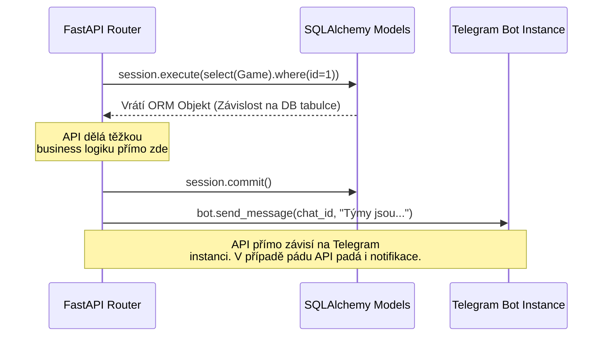
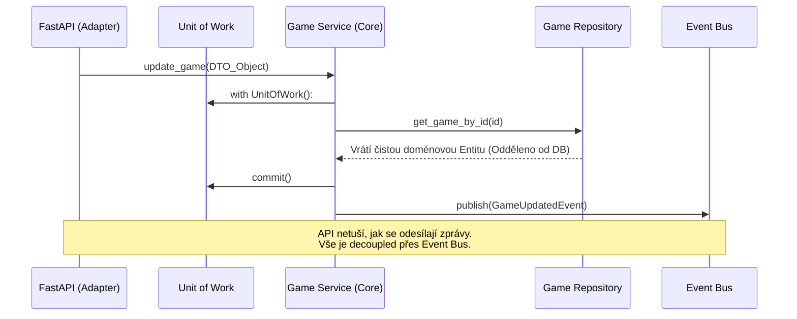

<!-- 
AI SYSTEM INSTRUCTION: ARCHITECTURAL UML STANDARDS (Mermaid)
To future AI models working on this file: Maintain the highest standard of technical diagrams. 
1. Use 'classDiagram' for structural models with 'direction TB'.
2. Represent Enums separately but CONNECT them via '..>' (uses) to the classes that depend on them.
3. Use 'o--' (aggregation)/ '1' -- '*' for compositions (e.g., Service has Repositories).
4. Label arrows clearly (e.g., : manages, : holds, : utilizes).
5. Prefer 'sequenceDiagram' for interaction flows (Ports/Adapters).
6. Ensure all entity-relationship mappings use cardinality ("1", "0..*") to show database/logic constraints.
Maintain professional clean aesthetic as established in the PJV Labyrinth project.
-->
# Football Manager Bot — NSS Semester Project

> [!CAUTION]
> ### AI ARCHITECT'S TECHNICAL AUDIT (CRITICAL ERRORS)
> 1. **Mermaid Rendering Failure**: The diagrams below are broken due to illegal empty lines within ` ```mermaid ` blocks. Mermaid syntax requires continuous lines without vertical spacing.
> 2. **Structural Gap**: The document claims a transition to **Hexagonal Architecture**, but lacks a **Class Diagram** (Ports/Adapters). Use `classDiagram` to show how Domain logic is decoupled from Interfaces.
> 3. **Formatting Hygiene**: Redundant line spacing (double newlines) throughout the file breaks the visual flow and makes the document 2x longer than necessary without adding value.
> 4. **Logic Desync**: In the sequence diagrams, the transition from ORM Objects to pure Domain Entities is mentioned but not visually enforced through specific types.

  

**Předmět:** B6B36NSS — Návrh softwarových systémů

**Tým:** Yernur Bauyrzhanuly

**Repozitář:** [github.com/yeronym/football-manager](https://github.com/yeronym/football-manager)

**Technologie:** Python 3.11 · FastAPI · Aiogram 3 · PostgreSQL · Redis · Docker

  

---

## 1. Popis aplikace a motivace

**Football Manager Bot** je automatizovaný systém pro správu amatérských fotbalových zápasů. Aplikace řeší reálný problém komunity 30+ hráčů v Praze: organizace týdenních zápasů, registrace hráčů, automatické sestavování vyrovnaných týmů a sledování ELO ratingu.
### Motivace a "Developer's Pain"

Původně vznikl bot jako jednoduchý skript, co sbíral "+" a "-" v Telegram skupině. Jak ale komunita rostla, amatérský kód přestal stačit. Když jsem chtěl přidat malou fičuru, musel jsem měnit kód na třech různých místech a riskoval jsem, že rozbiju celou aplikaci.

Cílem mé semestrální práce je ukázat **přerod obyčejného "amatérského" bota v profesionální, škálovatelný systém**. Jako student, který chce napsat kvalitní open-source/SaaS produkt, jsem se rozhodl kompletně přebudovat architekturu zevnitř. Změna architektury je nezbytná, protože v budoucnu plánuji z bota udělat plnohodnotný **Multi-tenant SaaS produkt**:

- Oddělené profily a ELO rating hráče pro každou skupinu (tabulka `PlayerProfile`).

- Nastavení jazyka a parametrů pro různé chaty (`ChatSettings`).

- B2B funkce (reklamní bannery, dashboard pro super-admina).

- Lokalizace do více jazyků (RU, EN, CS).

Bez čisté architektury by implementace těchto novinek vedla ke zhroucení vývoje.

---
## 2. Aktuální problémy a Anti-patterny (AS-IS)

Proč stará architektura brání dalšímu rozvoji?

### 1. God Object (Fat Router)

Modul, který vyřizoval API pro administrátory (`admin.py`), vyrostl na téměř 500 řádků kódu. Jeden jediný endpoint dělal všechno:

1. Ověřil initData z Telegramu.

2. Vyhledal přes SQL tabulku Game.

3. Přepočítal matematiku týmů (Business Logic).

4. Sestavil HTML string pro zprávu na Telegram.

5. Přímo zavolal objekt `bot.send_message`.

### 2. Layer Leakage (Protékaní abstrakcí)

Core vrstva aplikace naprosto ignorovala své hranice a dotýkala se přímo databázových modelů (SQLAlchemy). Znamená to, že jakákoliv změna v databázi např. kvůli přechodu na SaaS (`User` -> `PlayerProfile`) by znamenala přepisování celé API vrstvy a všech business algoritmů.

### AS-IS Diagram 




---
## 3. Cíl: Architektura TO-BE

Abychom tento architektonický dluh splatili a připravili aplikaci na SaaS funkce, předěláme aplikaci do **Hexagonální architektury (Ports and Adapters)** s využitím designových vzorů GoF.

Tento přístup oddělí naši cennou doménovou logiku (tvorba týmů, správa ELO) od infrastruktury (Databáze, Telegram API). Pokud budeme v budoucnu přidávat podporu pro WhatsApp nebo měnit DB na NoSQL řešení, doménová vrstva se nezmění.

### TO-BE Diagram 



---
## 4. Návrhové vzory (Design Patterns) pro řešení problémů

V rámci refaktoringu implementujeme následujících **5 vzorů**, abychom zajistili, že kód bude "future-proof":
  
1. **Unit of Work Pattern (Enterprise Pattern)**

- **Problém:** Nekonzistentní zápisy do DB. Když padl výpočet ELO, zápas se uložil, ale ELO ratingy už ne.

- **Řešení:** Centralizovaný `AsyncSession` přesedáví nad všemi repozitáři jako jeden celek, potvrzující všechny transakce plně atomicky. Nastane-li chyba, provede automatický `rollback()`.

2. **Repository Pattern (Architectural Pattern)**

- **Problém:** Layer leakage abstrakcí. Z API šlo poslat `.save()` i nedokončené entitě.

- **Řešení:** Úkryt datové vrstvy. `GameRepository` bude přijímat a vracet DTO (Data Transfer Objects), čímž získá Core vrstva úplnou nezávislost na SQLAlchemy ORM frameworku.

3. **Strategy Pattern (Behavioral GoF)**

- **Problém:** Hardcodovaný masivní algoritmus pro dělení týmů. Chceme v budoucnu různé metody na míru pro různé skupiny (SaaS feature).

- **Řešení:** V aplikaci vyčleněn `BalancerContext`, který může přepínat mezi `PositionFirstBalancingStrategy` a `SkillBasedBalancingStrategy`.

4. **Observer / Publisher-Subscriber (Behavioral GoF)**

- **Problém:** API znalo instanci bota, způsobovalo se zacyklení závislostí a padání.

- **Řešení:** Systém EventBusu. API dokončí akci a "naslepo" vyhlásí `GameCreatedEvent(id=5)`. V pozadí to zaslechne samostatný listener v sekci Telegram Bota a zpracuje odeslání zpráv. Aplikace a bot o sobě nevědí.
  
5. **Facade (Structural GoF)**

- **Problém:** Vytvoření zápasu vyžadovalo propojení databáze, výpisu týmů a aktivaci cron serverových scheduler jobů (připomenutí po XY hodinách).

- **Řešení:** Zaveden `GameLifecycleService`. API jednoduše zavolá `.create_game(DTO)`, a Facade už celou komplexní orchestraci (DB -> Scheduler -> EventBus) udělá interně. API zůstává čisté.

---

## 5. Funkční požadavky (Use Cases)

Aplikace musí nejen držet technickou úroveň, ale také splňovat klíčové SaaS potřeby s vícero úrovněmi uživatelů: 

| ID | Požadavek | Priorita |

|----|-----------|----------|

| FR-01 | **Spuštění SaaS:**| Vysoká |

| FR-02 | Správa parametrů skupiny pro administrátory (`/setup`) | Vysoká |

| FR-03 | WebApp: Profil hráče, ELO a vývojový graf hodnocení | Vysoká |

| FR-04 | Vytváření a úprava zápasů napříč tenanty přes UoW ochranu | Vysoká |

| FR-05 | WebApp: Leaderboard a historie zápasů | Střední |

  
---
## 6. Integrace a Technologický Ekosystém

Při architektonické přetavbě nadále splňujeme všechny předpoklady semestrální práce.

- **Technologie (povinné/C# alternativní stack):** Čistý asynchronní Python 3.11.

- **Databáze (povinné):** S použitím DTO a Repository je DB (PostgreSQL 15) bezbolestně modifikovatelná. Naváže se tabulka administrátorů.

- **Cacheování (volitelné):** Redis se využívá pro uchovávání cache WebApp Sessions a stavů.

- **Zabezpečení (volitelné):** Plná autentizace přes Telegram HMAC-SHA256 validující integritu WebApp komunikace zamezí únikům napříč multi-tenant profilem.

- **Využití Interceptors (volitelné):** Middleware (`app/api/main.py` + aiogram stack) slouží coby interceptor zachytávající kompletní traffic kvůli auditu před propadnutím k routerům.

- **Využití Technologie (volitelné):** Vše postaveno nad plně funkčním RESTful API.

- **Nasazení (nepovinné):** Docker Kontejnerizace běžící v Linux VPS jako live prostředí.

---