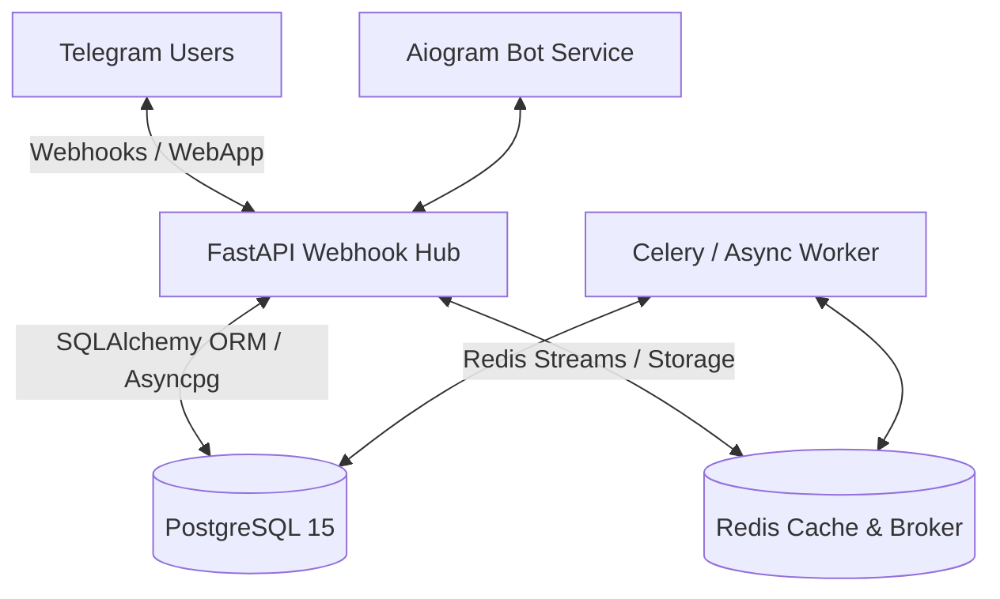

# Asynchronous Notification & Event Management System (Prague Football Manager)

A production-ready, highly-available asynchronous event management and automated notification platform tailored for amateur football communities. This project serves as a comprehensive showcase of modern backend engineering practices and hardened DevOps infrastructure.

---

## System Architecture

The application is structured into decoupled microservices communicating through shared storage and event brokers, ensuring high availability, zero-downtime deployments, and strict logical separation of concerns.

---

## Key Backend Engineering Hardening

### 1. Concurrency Control & Race Condition Mitigation
To avoid database double-booking anomalies during simultaneous match signups, the application utilizes database row-level locking. By enforcing transaction safety via `SELECT ... FOR UPDATE` query modifiers, player registration remains structurally atomic even under concurrent high load.

### 2. Multi-Tenant SaaS Architecture
The bot layer implements a custom routing middleware that dynamically intercepts incoming events and isolates group contexts. Each Telegram Group behaves as an independent tenant (with local settings, rosters, and ELO pools), utilizing unified schema storage while avoiding cross-tenant leaks.

---

## Infrastructure, Security & DevOps Hardening

### 1. Rootless Multi-Stage Containerization
The containerized runtime definitions in the `Dockerfile` are strictly hardened for production compliance:
* **Multi-Stage Builds:** Development dependencies, compilation tools, and build caches are isolated inside a builder stage, leaving a minimal, lightweight footprint in the runner image.
* **Non-Root Execution:** The system switches to a dedicated, non-privileged system user (`appuser`), minimizing host system vulnerability exposure in the event of an application exploit.
* **UV Cache Mounting:** Docker builds use a dedicated cache mount (`--mount=type=cache`) for the package installer to avoid retrieving packages sequentially on identical dependencies.

### 2. Microservice Network Segmentation & Port Seeding
The orchestrator configuration (`docker-compose.yml`) isolates critical infrastructure:
* Database (`db`) and Redis (`redis`) run on isolated bridge networks without direct internet exposure.
* Ingress to the cache is secured via password-only authentication (`--requirepass`), and host bindings are strictly pinned to localhost (`127.0.0.1`), neutralizing WAN access.

### 3. Automated Configuration Security & CI/CD Pipeline
Protected by a dual pipeline workflow (GitHub Actions & GitLab CI):
* **Lints & Security Audits:** Automatic analysis via Ruff and vulnerability scanning through Trivy config scanning.
* **Integration Tests:** The GitLab CI pipeline runs end-to-end integration tests using active database services before compiling production-ready container images.
* **Automated CD Integration:** Watchtower automatically pulls new images and executes zero-downtime updates as soon as the main pipeline uploads to the container registry.

### 4. Telemetry, Proactive Monitoring & Audits
* Application metrics are generated using FastAPI instrumentation and scraped via Prometheus (`/metrics`).
* Proactive environment health validation is verified dynamically inside docker runtimes using python-native testing utilities (`scripts/health_check.py`).
