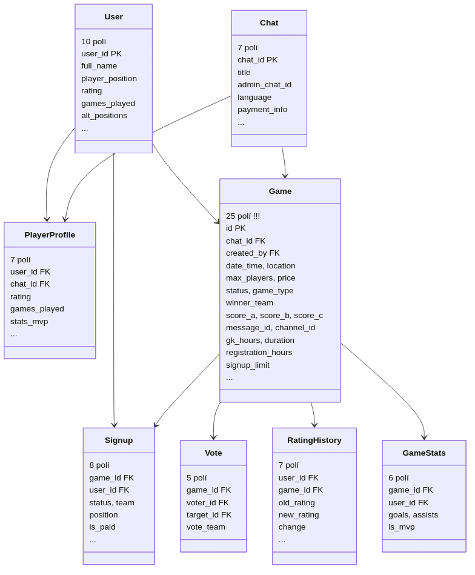
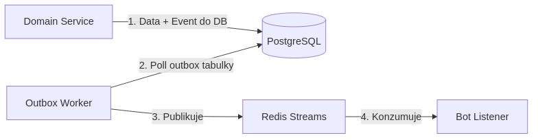

# ⚽ Football Manager Bot

[](https://www.python.org/)
[](https://docs.aiogram.dev/)
[](https://fastapi.tiangolo.com/)
[](https://www.postgresql.org/)
[](https://redis.io/)
[](https://www.docker.com/)

Automated system to manage amateur football communities. Handles active matches, signups, team balancing, ELO ratings, and user dashboards directly from Telegram.

Built with an asynchronous core using **Aiogram 3.x** and **FastAPI** to manage casual club or weekend community matches.

---

## Core Features

*   **Match Balancing**: Team balancer supporting ELO rating snake draft, role-based distribution (by positions), or random shuffling.
*   **Telegram WebApp**: Interface inside Telegram where players can view stats, register for fixtures, and view player ratings.
*   **Caching**: Redis-backed cache for game details with eviction on write.
*   **Messaging**: Event processing using Redis Streams with consumer groups.
*   **Security**: Signature validation for Telegram initData and role validation for group admins.

---

## 📸 App Preview

Here is a sneak peek of the Telegram WebApp and Bot interface:

<p align="center">
  
  
  
</p>

---

## 🛠️ Technical Stack & Architecture

| Layer | Technology | Key Implementation |
| :--- | :--- | :--- |
| **Frameworks** | Python 3.12 · FastAPI · Aiogram 3.x | Clean routing, asynchronous handlers, structured middleware. |
| **Database** | PostgreSQL 15 · SQLAlchemy (Async) | Strict models, optimized bulk actions, type-safe Enums (`CZ`, `EN`, `RU`). |
| **Caching** | Redis 7 | High-performance look-aside cache, active invalidation routes. |
| **Broker** | Redis Streams | Persistent pub/sub event processing with ACK validation. |
| **Search/Logs** | Elasticsearch · Telemetry Middleware | Resilient async HTTP logging with fail-safe fallbacks. |
| **CI/CD** | GitHub Actions · GHCR · Watchtower | Automated deployment pipelines. |

---

## 🚀 Quick Start & Local Development

This project uses **`uv`** — the ultra-fast Python package manager — for deterministic virtualenv and dependency lockfile resolution.

### Prerequisites
Make sure you have `docker` (with Compose) and `uv` installed.

### 1. Configure the Environment
Create your local configuration:
```bash
cp .env.example .env
```
Fill in your `BOT_TOKEN` (retrieved from [@BotFather](https://t.me/BotFather)) and adjust database credentials as needed.

### 2. Run the Stack (Docker Compose)
Launch the entire system (FastAPI app, PostgreSQL database, Redis instance, and Elasticsearch log sink):
```bash
docker compose up --build -d
```
*Note: Database migrations (`alembic upgrade head`) are executed automatically during the container boot sequence.*

### 3. Seed Database for Testing
Generate mockup data and authorize chats instantly:
```bash
# Seed authorized group chats from your .env file
docker compose exec app python app/presentation/cli/manage.py db seed-chats

# Populate historical matches and players for testing
docker compose exec app python app/presentation/cli/manage.py db seed-history
```

### 4. Running the Tests Locally
Our codebase has **100% green test coverage** (59 robust unit and integration tests). Run them with:
```bash
PYTHONPATH=. uv run --python 3.12 pytest tests/
```

---

## ⚙️ Environment Variables Reference

| Variable | Description | Default |
| :--- | :--- | :--- |
| `BOT_TOKEN` | Telegram Bot API Token | `YOUR_BOT_TOKEN_HERE` |
| `POSTGRES_DB` | Database name | `postgres` |
| `REDIS_URL` | Redis connections string | `redis://redis:6379/0` |
| `ELASTICSEARCH_URL`| Elasticsearch logging sink | `http://elasticsearch:9200` |
| `ADMIN_IDS` | JSON list of static admin IDs | `[]` |
| `SYSTEM_OWNER_ID` | Telegram ID of the system owner | `100000000` |
