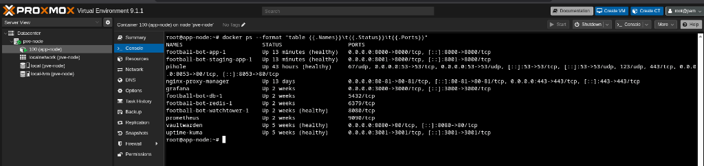

# 🎓 Football Manager Bot — B6B36NSS Semestrální Práce

[](https://fel.cvut.cz/)
[](https://cw.fel.cvut.cz/wiki/courses/b6b36nss/start)
[](#)

Tento repozitář obsahuje semestrální projekt předmětu **B6B36NSS (Návrh softwarových systémů)** na ČVUT FEL. Projekt je vyvíjen **samostatně** autorem **Yernur Bauyrzhanuly**.

Jedná se o komplexní produkční systém pro správu amatérské fotbalové komunity v Praze, implementovaný jako asynchronní Telegram Bot (Aiogram 3.x) a doprovodné WebApp rozhraní (FastAPI) s PostgreSQL, Redis, Elasticsearch a Redis Streams (Message Broker).

---

## 🗺️ Splnění požadavků (Mandatory & Optional Criteria)

Tato sekce slouží jako **hlavní rozcestník pro hodnocení** 2. odevzdání semestrální práce. Níže je detailně popsáno splnění všech povinných i volitelných požadavků ze zadání s přesným umístěním v kódu.

### 📌 1. Povinné požadavky (Mandatory Requirements)

*   **Výběr vhodné technologie a jazyka (Python 3.12 / FastAPI / Aiogram 3)**
    *   *Popis:* Zvolen moderní asynchronní stack na bázi Pythonu, který je ideální pro zpracování I/O operací při komunikaci s Telegram API a WebApp klienty.
    *   *Umístění:* Celý repozitář (soubor [pyproject.toml](pyproject.toml) a složka [app/](app/)).
*   **Využití DB (Relační)**
    *   *Popis:* Použitá asynchronní databáze PostgreSQL 15 s SQLAlchemy ORM a migračním nástrojem Alembic.
    *   *Umístění:* Konfigurace v [app/db/session.py](app/db/session.py) a datové modely v [app/db/models.py](app/db/models.py).
*   **Výběr vhodné architektury (Event-Driven / Layered)**
    *   *Popis:* Aplikace je rozdělena na prezentační vrstvu (Telegram Bot & REST API), aplikační služby (Service Layer), doménový model a infrastrukturu. Je použita architektura řízená událostmi (Event-Driven Architecture) pomocí asynchronního Event Busu a persistentního Redis Streams Brokeru.
    *   *Umístění:* [app/core/events.py](app/core/events.py) and [app/infrastructure/messaging.py](app/infrastructure/messaging.py).
*   **Použití alespoň 5 design patternů**
    *   *1. Strategy (Vzor Strategie):* Pro balancování týmů na základě různých algoritmů (Snake draft podle ELO, pozice hráčů, náhodně). 
        *   Třídy `RoleBasedBalancingStrategy`, `RatingSnakeBalancingStrategy`, `RandomBalancingStrategy` v [balancer.py#L48-L167](app/core/domain/balancer.py#L48-L167).
    *   *2. Facade (Vzor Fasáda):* Sjednocuje a zjednodušuje orchestraci vytváření, ukončování a aktualizace zápasů (databáze, notifikace, statistiky).
        *   Třída `GameLifecycleService` v [game_lifecycle.py](app/core/services/game_lifecycle.py).
    *   *3. Repository (Repozitář):* Odstiňuje databázové operace od doménové logiky.
        *   Rozhraní a implementace v [app/core/repositories/](app/core/repositories/).
    *   *4. Unit of Work (UoW):* Zabezpečuje transakční konzistenci (ACID) napříč více repozitáři v jednom requestu.
        *   Asynchronní kontextový manažer `UnitOfWork` v [uow.py](app/core/uow.py).
    *   *5. Observer (Publisher-Subscriber):* Asynchronní zpracování stavových událostí zápasu bez těsné vazby.
        *   Třída `EventBus` v [events.py](app/core/events.py).
*   **Use Cases (UC) - Netriviální systém**
    *   *Popis:* Systém obsahuje netriviální logiku pro správu hráčů, zápisy, balancování, ELO výpočty, a kompletní administrátorské rozhraní.
    *   *Příklady:* Zápis hráče a validace limitů ([roster.py](app/core/services/roster.py)), dokončení zápasu a přepočet ELO ([stats.py](app/core/services/stats.py)).
*   **Inicializační postup (Deployment & Seeding)**
    *   *Popis:* Popsán níže v sekci *Jak spustit a otestovat*. Obsahuje automatické migrace i seedování CLI příkazy.
    *   *Umístění:* CLI nástroj v [app/presentation/cli/manage.py](app/presentation/cli/manage.py) a [docker-compose.yml](docker-compose.yml).

---

### ⚡ 2. Volitelné a bonusové požadavky (Optional & Bonus Criteria)

*   **Využití Cache (Redis 7)**
    *   *Popis:* Implementována hybridní asynchronní cache. *Passive cache* (look-aside) kešuje náročné dotazy na detaily hry a sestav. *Active invalidation* okamžitě maže klíče z keše při jakémkoliv zápisu do soupisky (např. join/leave hráče).
    *   *Umístění:* Služba [app/core/services/cache.py](app/core/services/cache.py), použití v routeru [games.py](app/api/routers/games.py) a zneplatnění v [roster.py](app/core/services/roster.py).
*   **Využití Messaging principu (Redis Streams - Kafka-like Broker)**
    *   *Popis:* Implementován persistentní a robustní message broker nad Redis Streams. Zajišťuje doručení událostí (např. herních změn) asynchronním konzumentům s podporou spotřebitelských skupin (Consumer Groups) a explicitním potvrzováním (ACK - `XACK`). Chová se identicky jako Apache Kafka.
    *   *Umístění:* Producent a konzument v [app/infrastructure/messaging.py](app/infrastructure/messaging.py).
*   **Zabezpečení (Security - Telegram HMAC & OAuth2 analog)**
    *   *Popis:* Backend ověřuje kryptografický podpis `initData` přicházející z Telegram WebApp rozhraní pomocí SHA-256 HMAC klíče generovaného z bot tokenu (zaručuje autenticitu uživatele). Citlivé operace jsou dále chráněny kontrolou administrátorských oprávnění v chatu.
    *   *Umístění:* [app/api/auth.py](app/api/auth.py).
*   **Využití Interceptorů (FastAPI Middleware)**
    *   *Popis:* Třída `TelemetryInterceptorMiddleware` zachycuje veškerou HTTP komunikaci na vstupu i výstupu, měří čas odezvy v milisekundách a předává ji asynchronně logovacímu subsystému.
    *   *Umístění:* [app/api/middlewares.py](app/api/middlewares.py).
*   **REST API**
    *   *Popis:* Kompletní asynchronní rozhraní vystavené pomocí FastAPI s automatickou generací OpenAPI (Swagger) dokumentace.
    *   *Umístění:* Endpointy v [app/api/routers/](app/api/routers/).
*   **Využití Elasticsearch**
    *   *Popis:* Zachycená telemetrie z interceptoru je asynchronně (pomocí neblokujícího na pozadí běžícího `asyncio.create_task`) odesílána do Elasticsearch indexu `nss_telemetry` pro logování. Implementován fail-safe mechanismus, který v případě nedostupnosti ES aplikaci nijevak neovlivní.
    *   *Umístění:* [app/api/middlewares.py#L55-L71](app/api/middlewares.py#L55-L71).
*   **Nasazení na produkční server**
    *   *Způsob ověření a demonstrace:*
        *   Aplikace je plně kontejnerizována pomocí Dockeru a připravena pro provoz na libovolném Linux serveru (např. v Proxmox virtualizačním prostředí jako VM/LXC, nebo na privátním cloudu).
        *   **Ověření běžících služeb:** Běh všech kontejnerů na serveru lze ověřit příkazem `docker compose ps` (případně `docker ps`), který ukáže aktivní služby: FastAPI (`app`), PostgreSQL (`db`), Redis (`redis`) a Elasticsearch (`elasticsearch`).
        *   **Běh na serveru (Proxmox):** Produkční bot a související infrastruktura běží na serveru v rámci Docker kontejnerů. Níže je screenshot z administrace Proxmoxu s výpisem běžících kontejnerů (`docker ps`):
            
            
        *   **Kontrola logů v reálném čase:** Aktivitu bota a zpracování zpráv na serveru lze sledovat pomocí `docker compose logs -f app` (zde se vypisují asynchronní zprávy o doručení z brokeru a telemetrické logy z interceptoru).
        *   **CI/CD Pipeline:** Sestavení a publikace obrazů probíhá automaticky přes GitHub Actions (.github/workflows/deploy.yml).

---

## 🧪 Jak spustit a otestovat (Scénář pro hodnocení)

> [!NOTE]
> Aplikace je již nasazena a plně funkční na produkčním serveru (viz sekce **Nasazení na produkční server** výše). Tento návod slouží pro případné lokální spuštění a otestování vyučujícím.

Vyučující může veškeré technologie a splnění požadavků ověřit lokálně v několika jednoduchých krocích.

### Krok 1: Příprava prostředí a konfigurace
Zkopírujte příkladový konfigurační soubor:
```bash
cp .env.example .env
```
*Poznámka: Výchozí hodnoty v `.env.example` jsou přednastavené tak, aby vše okamžitě fungovalo v Docker prostředí.*

### Krok 2: Spuštění kompletního stacku
Pomocí Docker Compose spusťte aplikaci, databázi, Redis a Elasticsearch:
```bash
docker compose up --build -d
```
*Poznámka: Databázové migrace (`alembic upgrade head`) se spustí automaticky uvnitř kontejneru při startu.*

### Krok 3: Inicializace dat (Seeding)
Spusťte předpřipravené CLI příkazy pro autorizaci testovacích chatů a naplnění historie zápasů:
```bash
# Autorizace výchozích chatů z .env konfigurace
docker compose exec app python app/presentation/cli/manage.py db seed-chats

# Generování hráčů, zápasů a historie výsledků pro výpočet ELO statistik
docker compose exec app python app/presentation/cli/manage.py db seed-history
```

### Krok 4: Spuštění sady testů
Pro ověření bezchybnosti kódu (100% úspěšnost testů) spusťte:
```bash
PYTHONPATH=. uv run pytest tests/
```

### Krok 5: Verifikace technologií přes Swagger UI
Otevřete v prohlížeči adresu: **`http://localhost:8000/docs`**

1.  **Ověření Caching (Redis 7)**:
    *   Zavolejte `GET /api/game/1`. V logách aplikace uvidíte `❄️ Cache Miss for key: game_details:1`.
    *   Zavolejte endpoint podruhé. Data se okamžitě načtou z keše a v logách se vypíše `⚡ Cache Hit`.
    *   Stav a statistiky keše můžete sledovat na `GET /api/nss/cache/status`.
2.  **Ověření Message Brokeru (Redis Streams)**:
    *   Pošlete POST request na `/api/nss/messaging/publish?message=HelloNSS`.
    *   V logách uvidíte asynchronní doručení zprávy producentem do streamu a její následné vyzvednutí konzumentem pod příslušnou spotřebitelskou skupinou:
        *   `$$ -> Producing message --> {"content": "HelloNSS"}`
        *   `$$ -> Consumed Message -> {"content": "HelloNSS"}`
3.  **Ověření Interceptoru a Elasticsearch**:
    *   Pošlete libovolný HTTP request (např. status cache). Middleware interceptor změří dobu trvání.
    *   Ověřte stav připojení k Elasticsearch na `GET /api/nss/telemetry/status` (pokud lokální ES kontejner plně nastartoval, uvidíte stav `"connected"` a počet logů).
