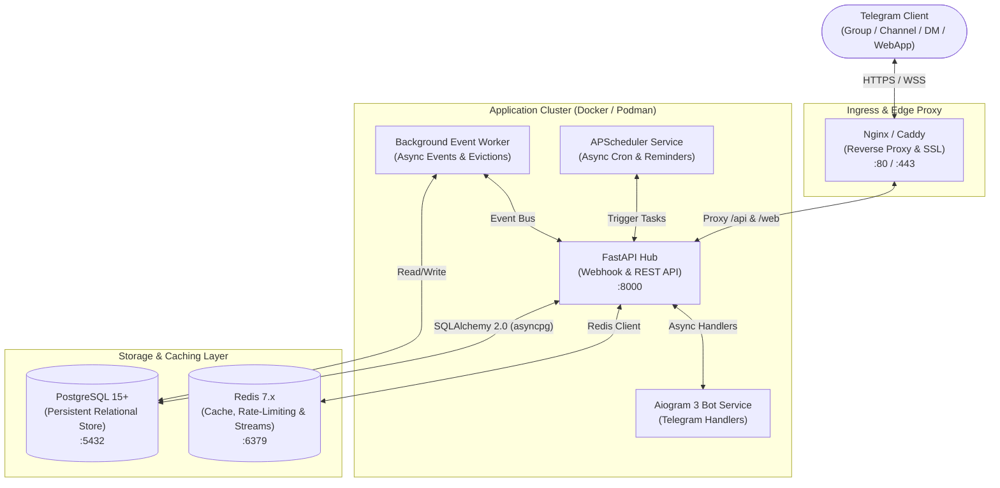
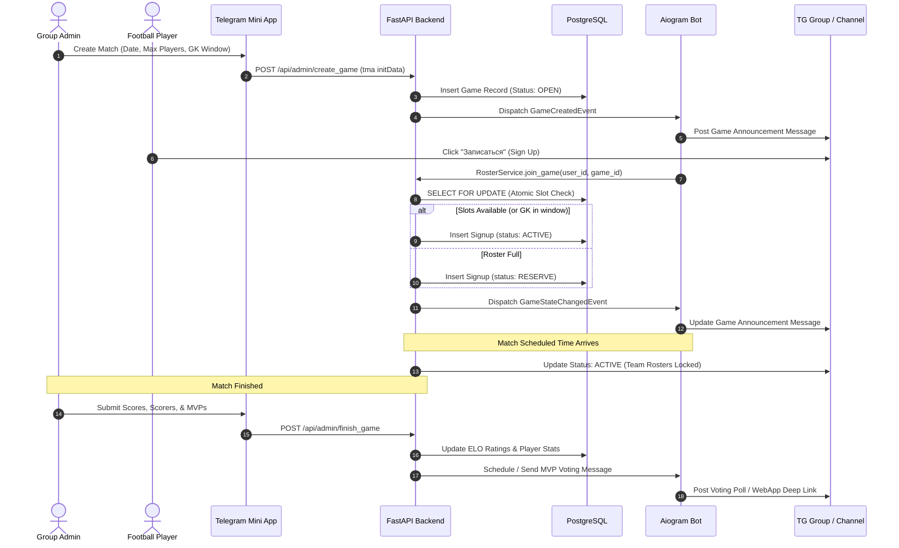
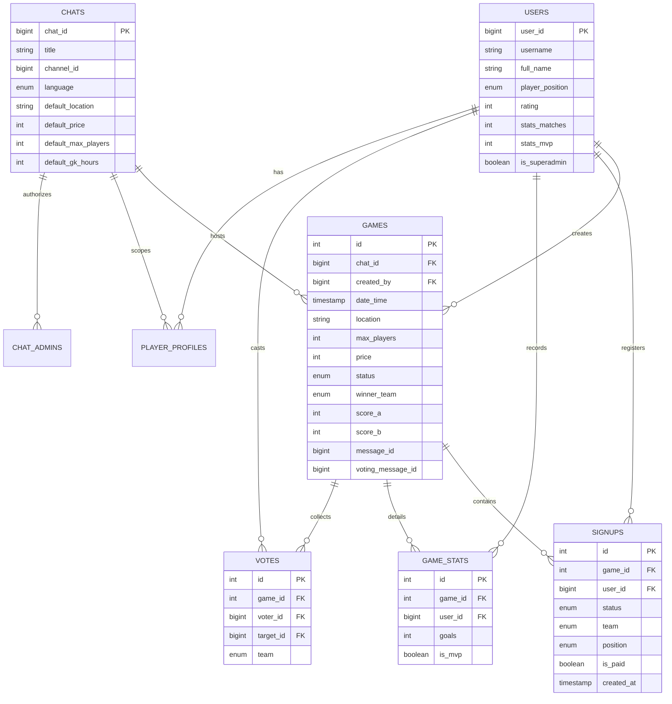

<div align="center">

# Prague Football Manager (PFM)

### An asynchronous, high-concurrency Telegram Bot, WebApp, and Event Orchestration Platform for sports communities

[](https://www.python.org/)
[](https://fastapi.tiangolo.com/)
[](https://docs.aiogram.dev/)
[](https://www.postgresql.org/)
[](https://redis.io/)
[](https://www.docker.com/)
[](./LICENSE)
[](./tests)

**A production-grade sports management system featuring automated Telegram group orchestrations, Telegram Mini Apps (WebApps), atomic concurrency-safe roster allocation, ELO skill balancing, automated MVP voting, and multi-tenant SaaS group management.**

</div>

---

## Table of Contents

- [System Overview](#system-overview)
- [Architecture & Request Flows](#architecture--request-flows)
  - [System Architecture](#system-architecture)
  - [Match Lifecycle & Event Flow](#match-lifecycle--event-flow)
  - [Concurrency-Safe Roster Allocation](#concurrency-safe-roster-allocation)
- [Tech Stack](#tech-stack)
- [Core Features](#core-features)
  - [Telegram Bot & Group Automation](#telegram-bot--group-automation)
  - [Telegram Mini Apps (WebApps)](#telegram-mini-apps-webapps)
  - [Dynamic Roster & Goalkeeper Priority Engine](#dynamic-roster--goalkeeper-priority-engine)
  - [Algorithmic Team Balancer & Auto-Draft](#algorithmic-team-balancer--auto-draft)
  - [Automated APScheduler & MVP Voting](#automated-apscheduler--mvp-voting)
  - [Multi-Tenant SaaS Architecture](#multi-tenant-saas-architecture)
- [Project Structure](#project-structure)
- [Setup & Installation](#setup--installation)
  - [Prerequisites](#prerequisites)
  - [Local Development Setup](#local-development-setup)
  - [Docker Compose Deployment](#docker-compose-deployment)
- [API & Telegram WebApp Route Reference](#api--telegram-webapp-route-reference)
  - [Authentication & Security](#authentication--security)
  - [Match Management Endpoints](#match-management-endpoints)
  - [Admin & Settings Endpoints](#admin--settings-endpoints)
  - [Roster & Draft Endpoints](#roster--draft-endpoints)
  - [Voting Endpoints](#voting-endpoints)
- [Database Design](#database-design)
- [Testing & Verification](#testing--verification)
- [Environment Variables Reference](#environment-variables-reference)
- [License](#license)

---

## System Overview

Prague Football Manager (PFM) coordinates amateur football communities, handling end-to-end match logistics. The platform automates announcement generation, signup queue management with goalkeeper reservation windows, balanced team drafting based on player ELO ratings, match score recording, and post-match MVP voting.

The platform provides a dual-interface architecture:
1. **Interactive Telegram Bot**: Responds in real-time to group chat and announcement channel interactions via webhooks or long-polling.
2. **Telegram WebApps (Mini Apps)**: Responsive HTML5/Vanilla JS interfaces loaded inside Telegram for complex actions (game creation, roster editing, team drafts, match finishing, and voting).

---

## Architecture & Request Flows

### System Architecture


```mermaid
graph TB
    Client(["Telegram Client<br/>(Group / Channel / DM / WebApp)"])

    subgraph Ingress["Ingress & Edge Proxy"]
        Nginx["Nginx / Caddy<br/>(Reverse Proxy & SSL)<br/>:80 / :443"]
    end

    subgraph AppStack["Application Cluster (Docker / Podman)"]
        FastAPI["FastAPI Hub<br/>(Webhook & REST API)<br/>:8000"]
        Aiogram["Aiogram 3 Bot Service<br/>(Telegram Handlers)"]
        Scheduler["APScheduler Service<br/>(Async Cron & Reminders)"]
        Worker["Background Event Worker<br/>(Async Events & Evictions)"]
    end

    subgraph DataStack["Storage & Caching Layer"]
        Postgres[("PostgreSQL 15+<br/>(Persistent Relational Store)<br/>:5432")]
        Redis[("Redis 7.x<br/>(Cache, Rate-Limiting & Streams)<br/>:6379")]
    end

    Client <-->|"HTTPS / WSS"| Nginx
    Nginx <-->|"Proxy /api & /web"| FastAPI
    FastAPI <-->|"Async Handlers"| Aiogram
    FastAPI <-->|"SQLAlchemy 2.0 (asyncpg)"| Postgres
    FastAPI <-->|"Redis Client"| Redis
    Scheduler <-->|"Trigger Tasks"| FastAPI
    Worker <-->|"Event Bus"| FastAPI
    Worker <-->|"Read/Write"| Postgres
```

### Match Lifecycle & Event Flow


```mermaid
sequenceDiagram
    autonumber
    actor Admin as Group Admin
    actor Player as Football Player
    participant WebApp as Telegram Mini App
    participant API as FastAPI Backend
    participant DB as PostgreSQL
    participant Bot as Aiogram Bot
    participant Channel as TG Group / Channel

    Admin->>WebApp: Create Match (Date, Max Players, GK Window)
    WebApp->>API: POST /api/admin/create_game (tma initData)
    API->>DB: Insert Game Record (Status: OPEN)
    API->>Bot: Dispatch GameCreatedEvent
    Bot->>Channel: Post Game Announcement Message
    
    Player->>Channel: Click "Записаться" (Sign Up)
    Bot->>API: RosterService.join_game(user_id, game_id)
    API->>DB: SELECT FOR UPDATE (Atomic Slot Check)
    alt Slots Available (or GK in window)
        API->>DB: Insert Signup (status: ACTIVE)
    else Roster Full
        API->>DB: Insert Signup (status: RESERVE)
    end
    API->>Bot: Dispatch GameStateChangedEvent
    Bot->>Channel: Update Game Announcement Message

    Note over API,Bot: Match Scheduled Time Arrives
    API->>Channel: Update Status: ACTIVE (Team Rosters Locked)
    
    Note over Admin,API: Match Finished
    Admin->>WebApp: Submit Scores, Scorers, & MVPs
    WebApp->>API: POST /api/admin/finish_game
    API->>DB: Update ELO Ratings & Player Stats
    API->>Bot: Schedule / Send MVP Voting Message
    Bot->>Channel: Post Voting Poll / WebApp Deep Link
```

### Concurrency-Safe Roster Allocation

```mermaid
flowchart TD
    Start([User clicks 'Записаться']) --> Lock[Acquire Row-Level Lock on Game]
    Lock --> CheckRegistrationWindow{Registration Window Open?}
    CheckRegistrationWindow -- No --> RejectWindow[Reject: Registration closed]
    CheckRegistrationWindow -- Yes --> CheckMaxLimit{Signups >= signup_limit?}
    CheckMaxLimit -- Yes --> RejectLimit[Reject: Hard limit reached]
    CheckMaxLimit -- No --> CheckActiveCount{Active Players < max_players?}
    CheckActiveCount -- No --> PutReserve[Place in RESERVE list]
    CheckActiveCount -- Yes --> CheckGKWindow{In GK Priority Window?}
    CheckGKWindow -- No --> PutActive[Place in ACTIVE main roster]
    CheckGKWindow -- Yes --> CalcNeededGK[Calculate remaining needed GKs:<br/>needed_gks = max(0, 2 - active_gk_count)]
    CalcNeededGK --> CheckSlotsLeft{slots_left <= needed_gks?}
    CheckSlotsLeft -- No --> PutActive
    CheckSlotsLeft -- Yes --> IsPlayerGK{Is Player a GK?}
    IsPlayerGK -- Yes --> PutActive
    IsPlayerGK -- No --> PutReserve
    PutActive --> SaveDB[Persist Signup in DB]
    PutReserve --> SaveDB
    SaveDB --> Commit[Commit Transaction & Evict Cache]
    Commit --> UpdateMsg[Trigger Bot Message Update]
```

---

## Tech Stack

| Category | Technology | Version | Purpose in Prague Football Manager |
|:---|:---|:---|:---|
| **Runtime & Language** | Python | `3.11` – `3.14` | Core asynchronous application runtime |
| **Web Framework** | FastAPI | `0.115+` | High-throughput asynchronous REST API & WebApp hub |
| **Bot Framework** | Aiogram | `3.x` | Asynchronous Telegram Bot API wrapper with FSM |
| **Database** | PostgreSQL | `15+` | Relational storage for users, games, signups, and stats |
| **Async DB Driver** | asyncpg | `0.30+` | High-performance PostgreSQL async driver |
| **ORM & Migrations** | SQLAlchemy & Alembic | `2.0+` | Unit of work, declarative models, schema revisions |
| **Cache & Message Broker** | Redis | `7.x` | In-memory query caching, rate limiting, and event queues |
| **Task Scheduling** | APScheduler | `3.10+` | Async scheduled jobs (voting reminders, match closures) |
| **Containerization** | Docker & Compose | `20+` | Multi-stage, non-root microservice orchestration |
| **Linting & Code Quality**| Ruff | `Latest` | High-speed static analysis, formatting, and linting |
| **Test Suite** | Pytest & pytest-asyncio | `8.x` | Unit, integration, concurrency, and E2E smoke tests |
| **Metrics & Monitoring** | Prometheus & Watchtower | `Latest` | Telemetry scraping and automated container deployment |

---

## Core Features

### Telegram Bot & Group Automation
- **Announcement Rendering**: Dynamic match announcements featuring match format (e.g. `11x11`, `8x8`), participant counts, date/time in Prague local timezone, pricing, payment details, and player rosters categorized by field positions (`GK`, `DEF`, `MID`, `FWD`).
- **One-Click Actions**: Inline buttons allow players to sign up, withdraw, toggle goalkeeper status, or open the WebApp directly from group chats and announcement channels.
- **Auto-Promotion Queue**: When an active player leaves a match, the top reserve player is automatically promoted to the main roster with a direct Telegram notification.

### Telegram Mini Apps (WebApps)
- **Game Creator & Editor (`index.html`, `edit_game.html`)**: Mobile-first WebApps utilizing Telegram theme parameters, Flatpickr datepickers, and real-time validation.
- **Match Finisher (`finish.html`)**: Interactive score recorder with team scoreboards, goalscorer inputs, and MVP designations.
- **Team Draft & Balancer (`draft.html`)**: Visual drag-and-drop or one-click team assignment interface with real-time team balance metrics.
- **MVP Voting Interface (`vote.html`)**: Candidate selection UI for players to cast MVP votes post-match.

### Dynamic Roster & Goalkeeper Priority Engine
- **Configurable GK Reservation Window**: Matches allow reserving goalkeeper spots (e.g., 2 spots for 2 teams) during a specified time window (`gk_hours`) prior to kickoff.
- **Smart Quota Allocation**: Evaluates active goalkeeper counts in real-time, preventing field players from occupying the final reserved slots only when goalkeepers are still required.
- **Registration Time Windows**: Optional `registration_hours` window restricts premature signups before announcement periods.

### Algorithmic Team Balancer & Auto-Draft
- **Position & Rating Balancer**: Distributes players across teams (2 or 3 teams) optimizing for equal aggregate ELO rating while maintaining position balance (equal GKs and defenders per team).
- **Manual Adjustments**: Administrators can override auto-generated teams directly in the WebApp or Telegram inline keyboards before publishing.

### Automated APScheduler & MVP Voting
- **Match Closure Detection**: Schedules automated status transitions from `OPEN` to `ACTIVE` when the match starts, and prompts admins to finalize scores upon match conclusion.
- **Channel & Group Adaptive Voting**: Delivers interactive callback buttons in group chats, while automatically using URL deep links (`https://t.me/<bot>?start=vote_<id>`) when posting to Telegram Channels to comply with Telegram Bot API constraints.

### Multi-Tenant SaaS Architecture
- **Per-Chat Isolation**: Distinct Telegram groups maintain their own configuration profiles (currency, pricing, default rosters, match duration, language, and admin permissions).
- **Group-Specific Player Profiles**: Tracks player statistics, match participation counts, and ELO ratings partitioned by group context.

---

## Project Structure

```
footballManagerBot/
├── alembic/                       # Database schema migrations
│   ├── versions/                  # Revision scripts
│   └── env.py                     # Async migration runner
├── app/
│   ├── api/                       # REST API & WebApp Hub
│   │   ├── auth.py                # TMA initData validation & admin auth
│   │   ├── main.py                # FastAPI factory & lifespan
│   │   ├── schemas.py             # Pydantic v2 request/response schemas
│   │   └── routers/               # Endpoint routers
│   │       ├── admin.py           # Game creation, finish, player management
│   │       ├── dashboard.py       # SaaS group admin dashboard
│   │       ├── games.py           # Match details, history, open games
│   │       ├── users.py           # User profiles & leaderboards
│   │       └── voting.py          # MVP voting submission & queries
│   ├── bot/                       # Telegram Bot Layer (Aiogram 3)
│   │   ├── handlers/              # Command, callback & FSM handlers
│   │   ├── instance.py            # Bot & Dispatcher singleton
│   │   ├── keyboards.py           # Inline & Reply keyboard factories
│   │   ├── listeners.py           # Domain event subscribers & message publishers
│   │   └── utils.py               # Announcement formatters & sequential numbering
│   ├── core/                      # Domain & Business Logic
│   │   ├── domain/                # DTOs & team balancing algorithms
│   │   ├── events.py              # In-process asynchronous Event Bus
│   │   ├── repositories/          # DB access repositories (Game, User, Signup)
│   │   ├── services/              # GameLifecycle, RosterService, StatsService
│   │   └── uow.py                 # Async Unit of Work pattern
│   ├── db/                        # Database Layer
│   │   ├── database.py            # Async engine & sessionmaker
│   │   └── models.py              # Declarative SQLAlchemy models
│   ├── infrastructure/            # Scheduling & External Services
│   │   └── scheduler/             # APScheduler service wrappers
│   ├── web/                       # Telegram WebApps (Static HTML/JS/CSS)
│   │   ├── admin.html             # SaaS multi-group admin panel
│   │   ├── draft.html             # Visual team drafting tool
│   │   ├── edit_game.html         # Match parameter editor
│   │   ├── finish.html            # Score submission & MVP selector
│   │   ├── index.html             # Match creation WebApp
│   │   └── vote.html              # Post-match MVP voting WebApp
│   ├── config.py                  # Pydantic settings & environment validation
│   └── worker.py                  # Standalone background consumer entrypoint
├── monitoring/                    # Prometheus scrapers & monitoring configs
├── scripts/                       # DevOps & maintenance scripts
├── tests/                         # Pytest Automated Test Suite
│   ├── conftest.py                # Async SQLite DB fixtures & mock factories
│   ├── e2e/                       # Smoke tests
│   ├── integration/               # Database migrations & scheduler tasks
│   └── unit/                      # Unit tests (API, Bot, Core, Balancer)
├── docker-compose.yml             # Production & staging service orchestration
├── Dockerfile                     # Multi-stage hardened runner image
├── pyproject.toml                 # Dependencies & tool configurations
└── README.md                      # Comprehensive documentation
```

---

## Setup & Installation

### Prerequisites

- **Python**: Version `3.11+` (tested through `3.14`)
- **Database**: PostgreSQL `15+`
- **Cache**: Redis `7+`
- **Telegram Bot Token**: Obtained from [@BotFather](https://t.me/BotFather)

---

### Local Development Setup

1. **Clone the Repository**:
   ```bash
   git clone https://github.com/yeronymus/football-manager.git
   cd football-manager
   ```

2. **Create and Activate a Virtual Environment**:
   ```bash
   # Linux / macOS
   python3 -m venv .venv
   source .venv/bin/activate

   # Windows (PowerShell)
   python -m venv .venv
   .\.venv\Scripts\Activate.ps1
   ```

3. **Install Dependencies**:
   ```bash
   pip install -e .
   # Or using uv (recommended for ultra-fast installs):
   uv pip install -e .
   ```

4. **Configure Environment Variables**:
   ```bash
   cp .env.example .env
   ```
   *Edit `.env` and provide your `BOT_TOKEN`, `POSTGRES_*` credentials, and `REDIS_PASSWORD`.*

5. **Apply Database Migrations**:
   ```bash
   alembic upgrade head
   ```

6. **Run the Application**:
   ```bash
   # Run the FastAPI server (handles Webhooks and Mini Apps)
   uvicorn app.api.main:app --host 0.0.0.0 --port 8000 --reload

   # In a separate terminal, run the Telegram Bot polling (for local testing without public IP)
   python manage.py runbot
   ```

---

### Docker Compose Deployment

The repository includes a production-hardened `docker-compose.yml` supporting isolated internal networking, healthchecks, and non-root execution:

1. **Launch the Core Production Stack**:
   ```bash
   docker compose up -d --build
   ```

2. **Verify Services Health**:
   ```bash
   docker compose ps
   ```

3. **Deploy Staging Profile (Optional)**:
   ```bash
   docker compose --profile staging up -d
   ```

---

## API & Telegram WebApp Route Reference

All WebApp and administrative endpoints authenticate requests via the Telegram Mini App `initData` signature.

### Authentication & Security

Client requests transmit the Telegram WebApp initData string either via query parameters or using the `Authorization` header:

```http
Authorization: tma query_id=...&user=...&auth_date=...&hash=...
```

The backend parses the string, computes an HMAC-SHA256 signature using the secret key derived from `BOT_TOKEN`, and performs constant-time validation (`hmac.compare_digest`) to prevent timing attacks.

---

### Match Management Endpoints

| Method | Endpoint | Access | Description |
|:---|:---|:---|:---|
| `GET` | `/api/games/game/{game_id}` | Public / Auth | Retrieves match metadata, team rosters, reserve queue, and sequential game number. |
| `GET` | `/api/games/history/{chat_id}` | Authenticated | Retrieves the last 100 finished matches for a specific chat group. |
| `GET` | `/api/games/games/open` | Admin | Lists upcoming and editable matches for the authenticated admin. |
| `POST` | `/api/admin/create_game` | Admin | Creates a new match, schedules reminders, and dispatches the announcement. |
| `POST` | `/api/admin/update_game` | Admin | Updates match parameters (location, limits, pricing, registration windows). |
| `POST` | `/api/admin/finish_game` | Admin | Records scores, player goals, awards MVPs, updates ELO, and launches voting. |

---

### Admin & Settings Endpoints

| Method | Endpoint | Access | Description |
|:---|:---|:---|:---|
| `GET` | `/api/dashboard/groups` | Admin / Superadmin | Returns all groups where the user has administrative privileges. |
| `GET` | `/api/dashboard/groups/{chat_id}/games` | Admin | Retrieves paginated match summaries with payment and attendance statistics. |
| `PATCH` | `/api/dashboard/groups/{chat_id}` | Admin | Updates tenant-specific settings (pricing, default duration, GK hours). |
| `POST` | `/api/dashboard/signups/{signup_id}/toggle_pay` | Admin | Toggles payment status for a specific player signup. |

---

### Roster & Draft Endpoints

| Method | Endpoint | Access | Description |
|:---|:---|:---|:---|
| `POST` | `/api/admin/balance_teams` | Admin | Generates balanced team rosters using the ELO and position optimization algorithm. |
| `POST` | `/api/admin/update_teams` | Admin | Persists manual team roster changes made in the WebApp draft editor. |
| `POST` | `/api/admin/add_player` | Admin | Manually inserts a registered player into a match's active roster. |
| `POST` | `/api/admin/add_guest` | Admin | Adds a guest player (without a Telegram account) to the roster. |

---

### Voting Endpoints

| Method | Endpoint | Access | Description |
|:---|:---|:---|:---|
| `GET` | `/api/voting/game/{game_id}/candidates` | Authenticated | Fetches eligible players eligible for post-match MVP selection. |
| `POST` | `/api/voting/vote` | Authenticated | Casts a vote for Team A, Team B, and/or Team C MVPs. |
| `GET` | `/api/voting/game/{game_id}/results` | Authenticated | Fetches aggregated vote counts for a match. |

---

## Database Design


```mermaid
erDiagram
    CHATS ||--o{ GAMES : hosts
    CHATS ||--o{ PLAYER_PROFILES : scopes
    CHATS ||--o{ CHAT_ADMINS : authorizes
    USERS ||--o{ GAMES : creates
    USERS ||--o{ SIGNUPS : registers
    USERS ||--o{ GAME_STATS : records
    USERS ||--o{ VOTES : casts
    USERS ||--o{ PLAYER_PROFILES : has
    GAMES ||--o{ SIGNUPS : contains
    GAMES ||--o{ GAME_STATS : details
    GAMES ||--o{ VOTES : collects

    CHATS {
        bigint chat_id PK
        string title
        bigint channel_id
        enum language
        string default_location
        int default_price
        int default_max_players
        int default_gk_hours
    }

    USERS {
        bigint user_id PK
        string username
        string full_name
        enum player_position
        int rating
        int stats_matches
        int stats_mvp
        boolean is_superadmin
    }

    GAMES {
        int id PK
        bigint chat_id FK
        bigint created_by FK
        timestamp date_time
        string location
        int max_players
        int price
        enum status
        enum winner_team
        int score_a
        int score_b
        bigint message_id
        bigint voting_message_id
    }

    SIGNUPS {
        int id PK
        int game_id FK
        bigint user_id FK
        enum status
        enum team
        enum position
        boolean is_paid
        timestamp created_at
    }

    GAME_STATS {
        int id PK
        int game_id FK
        bigint user_id FK
        int goals
        boolean is_mvp
    }

    VOTES {
        int id PK
        int game_id FK
        bigint voter_id FK
        bigint target_id FK
        enum team
    }
```

---

## Testing & Verification

The project includes an automated test suite with **115 passing tests** across unit, integration, and E2E tiers.

```bash
# Execute the full test suite
pytest

# Run tests with verbose output
pytest -v

# Run specific domain test modules
pytest tests/unit/core/services/test_roster_limits.py
pytest tests/integration/test_scheduler_tasks.py
pytest tests/unit/bot/test_utils.py

# Run static analysis & style enforcement
ruff check .
```

### Test Suite Summary

```
====================== 115 passed, 3 warnings in 30.57s =======================
```

- **Roster Limits & GK Priority**: Verifies active GK limits, window boundaries, reserve transitions, and slot availability up to 18 players.
- **Scheduler & Voting**: Verifies automated voting message dispatch, group callback keyboard delivery, and channel URL button fallbacks.
- **Sequential Game Numbering**: Verifies sequential counting, skipping cancelled games (18 -> 19 despite IDs 19-43 being cancelled), and fallback safety.
- **Team Balancer**: Verifies position allocation, rating differential minimization, and 3-team balance calculations.
- **Authentication & Security**: Verifies TMA initData parsing, expired signatures, invalid hashes, and admin privilege verification.

---

## Environment Variables Reference

| Variable | Type | Required | Default | Description |
|:---|:---:|:---:|:---:|:---|
| `BOT_TOKEN` | String | **Yes** | — | Telegram Bot API Token obtained from [@BotFather](https://t.me/BotFather) |
| `BOT_USERNAME` | String | No | — | Username of the Telegram bot (without `@`) |
| `POSTGRES_USER` | String | **Yes** | `postgres` | PostgreSQL database user |
| `POSTGRES_PASSWORD` | String | **Yes** | — | PostgreSQL database password |
| `POSTGRES_DB` | String | **Yes** | `football_manager` | PostgreSQL database name |
| `POSTGRES_HOST` | String | **Yes** | `db` | Database hostname or container service name |
| `POSTGRES_PORT` | Integer | No | `5432` | PostgreSQL port |
| `REDIS_HOST` | String | No | `redis` | Redis service hostname |
| `REDIS_PORT` | Integer | No | `6379` | Redis port |
| `REDIS_PASSWORD` | String | **Yes** | — | Authentication password for Redis server |
| `WEBAPP_URL` | String | **Yes** | — | Public HTTPS URL where the WebApps are hosted |
| `SYSTEM_OWNER_ID` | Integer | **Yes** | — | Telegram User ID of the primary platform superadmin |
| `ADMIN_IDS` | List[int] | No | `[]` | Comma-separated list of global superadmin Telegram IDs |
| `APP_PORT` | Integer | No | `8000` | Host port mapped to FastAPI web application |
| `RUN_BOT` | Boolean | No | `True` | Whether the application container should start bot polling |

---

## License

This project is open-source software licensed under the [MIT License](./LICENSE).
