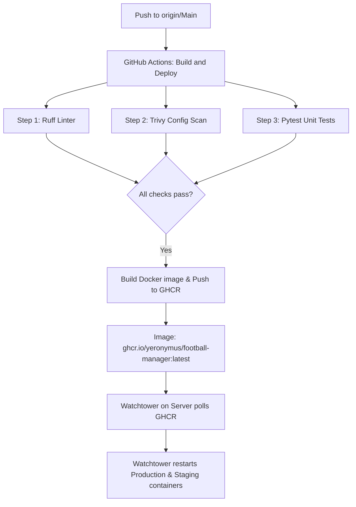

# Infrastructure & GitFlow Documentation

This document describes the server architecture, network topology, container configurations, and the CI/CD deployment workflow (GitFlow) for the Football Manager Bot application.

---

## 🖥️ Server Configurations

*   **Host IP (Tailscale):** `100.105.7.87`
*   **SSH Access:** Port `22`, User `root` (Authenticated via Tailscale SSH).
*   **Directory Layout:**
    *   `/root/football-bot`: Git repository, application code, `.env` file, database migrations, and the app's `docker-compose.yml`.
    *   `/opt/app-stack/`: Global system infrastructure directory:
        *   `/opt/app-stack/monitoring/`: Prometheus and Grafana configuration and compose.
        *   `/opt/app-stack/uptime-kuma/`: Uptime Kuma service.
        *   `/opt/app-stack/vaultwarden/`: Vaultwarden password manager.

---

## 📦 Docker Containers & Network Topology

### 1. Active Containers

| Container Name | Image | Network | Exposed Ports | Description |
| :--- | :--- | :--- | :--- | :--- |
| `football-bot-app-1` | `ghcr.io/yeronymus/football-manager:latest` | `football-bot_default` | `8000:8000` | Production FastAPI App & Telegram Bot |
| `football-bot-staging-app-1` | `ghcr.io/yeronymus/football-manager:latest` | `football-bot_default` | `8001:8000` | Staging/Testing FastAPI App |
| `football-bot-db-1` | `postgres:15-alpine` | `football-bot_default` | Internal | PostgreSQL database |
| `football-bot-redis-1` | `redis:7-alpine` | `football-bot_default` | Internal | Redis Cache & Message Broker |
| `football-bot-watchtower-1` | `containrrr/watchtower` | `football-bot_default` | Internal | Auto-update docker images |
| `prometheus` | `prom/prometheus:latest` | `monitoring_default` | Internal | Metrics collector |
| `grafana` | `grafana/grafana-oss:latest` | `monitoring_default` | `3000:3000` | Visualization dashboard |
| `nginx-proxy-manager` | `jc21/nginx-proxy-manager:latest` | `npm_default` | `80`, `81`, `443` | Reverse proxy and SSL management |
| `pihole` | `pihole/pihole:latest` | `pihole_default` | `53`, `8053` | DNS & Ad-blocking service |
| `vaultwarden` | `vaultwarden/server:latest` | `app-stack_default` | `8080:80` | Vaultwarden instance |
| `uptime-kuma` | `louislam/uptime-kuma:1` | `app-stack_default` | `3001:3001` | Uptime checker |

---

### 2. Network Layout & Metrics Collection

*   **`football-bot_default`:** Contains the main app, staging app, postgres, and redis database.
*   **`monitoring_default`:** Contains Prometheus and Grafana.
*   **Metrics Scraping Mechanism:** 
    Since `prometheus` is in `monitoring_default` and cannot resolve the app by its container hostname, it queries the FastAPI app via the Docker host gateway (`172.21.0.1`) where the host-mapped ports are exposed:
    *   **Production App Metrics:** `http://172.21.0.1:8000/metrics`
    *   **Staging App Metrics:** `http://172.21.0.1:8001/metrics`
    *   **Host System Metrics:** `http://100.90.175.9:9100/metrics` (Proxmox host node exporter).

---

## 🔄 GitFlow & CI/CD Deployment Pipeline

### 1. Development & Version Control
1.  **Branching Structure:**
    *   `Main` (Capitalised): Protected production branch on GitHub.
    *   `develop`: Branch for feature integration.
2.  **Git Config:**
    *   The `gitlab` remote has been removed. Local development tracks the GitHub remote `origin/Main`.

### 2. CI/CD Pipeline
*   **Configuration:** `.github/workflows/deploy.yml`
*   **Triggers:** Pushes and Pull Requests on `Main` and `develop` branches.
*   **Execution:**
    1.  **Code Checkouts & Python Setup:** Pulls latest code and sets up Python 3.12 with `uv`.
    2.  **Linting:** Runs `ruff check` on the codebase.
    3.  **Security Scans:** Checks configuration safety using `trivy` (configured as non-blocking `exit-code: 0` to prevent minor config warnings from halting builds).
    4.  **Testing:** Executes the Pytest unit testing suite.
    5.  **Build & Publish:** Builds the Docker image using multi-stage builds (`Dockerfile`) and publishes the package to GitHub Container Registry (GHCR).

### 3. Server Auto-Deploy
*   **Watchtower Auto-Updates:** The `football-bot-watchtower-1` container on the server checks GHCR every 300 seconds (5 minutes). When a new `latest` tag is pushed to GHCR, Watchtower automatically pulls it and recreates `football-bot-app-1` and `football-bot-staging-app-1` with the fresh image.
