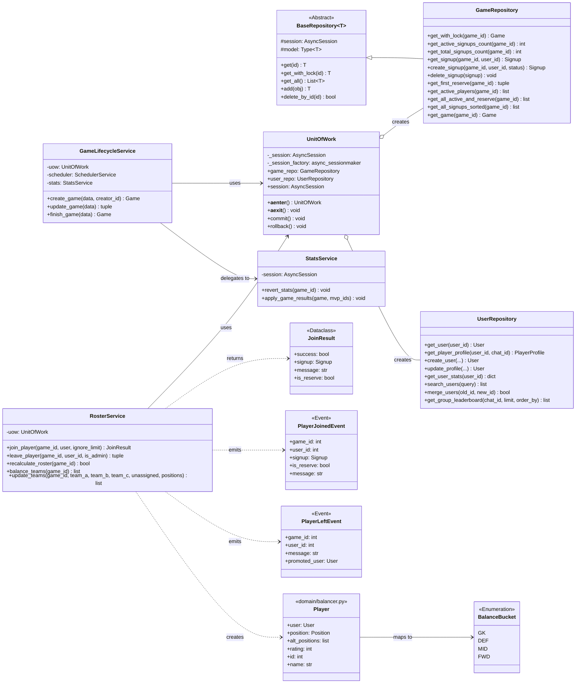
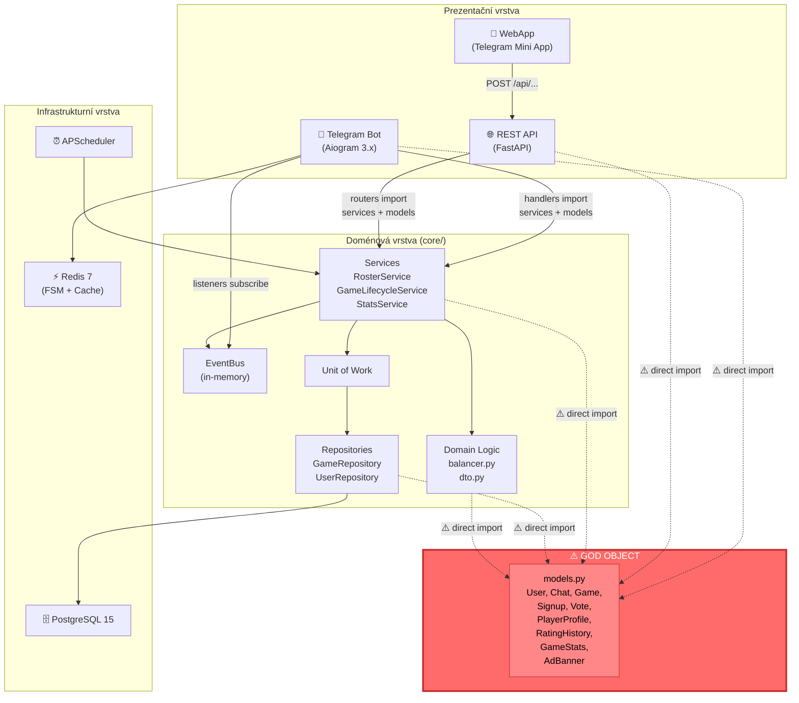
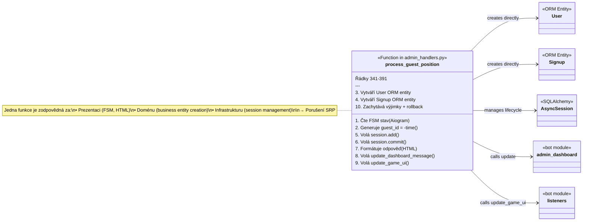
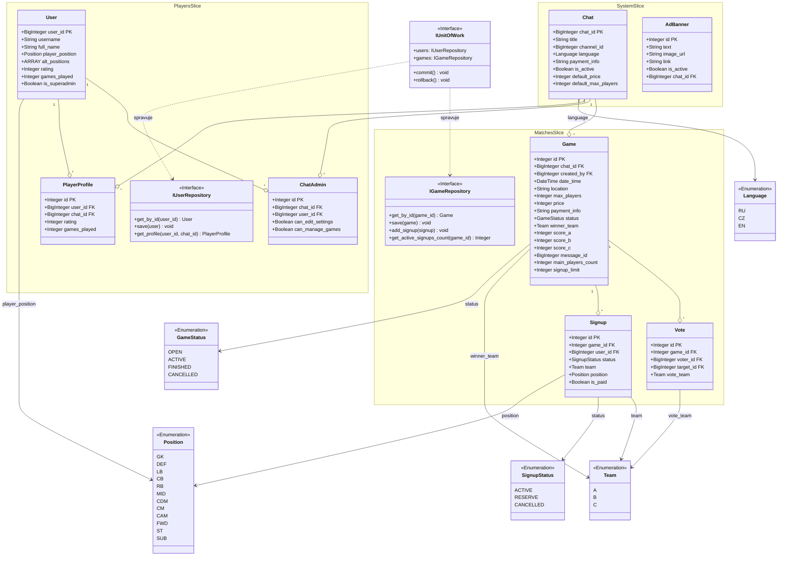

# Football Manager Bot — NSS Semestrální práce (Milestone 1)

**Předmět:** B6B36NSS — Návrh softwarových systémů  
**Autor:** Yernur Bauyrzhanuly  
**Repozitář:** [gitlab.fel.cvut.cz/bauyryer/football-bot-nss](https://gitlab.fel.cvut.cz/bauyryer/football-bot-nss)  
**Technologie:** Python 3.11 · FastAPI · Aiogram 3.x · PostgreSQL 15 · Redis 7 · Docker

---

## 1. Popis aplikace a motivace

**Football Manager Bot** je komplexní systém pro správu amatérské fotbalové komunity v Praze. Systém pokrývá celý životní cyklus zápasu — od vyhlášení termínu, přes automatizovanou registraci hráčů (FIFO fronta s prioritou pro brankáře), algoritmické vyvažování týmů na základě ELO ratingu a herních pozic, až po sběr post-match statistik (góly, MVP hlasování) a aktualizaci ratingů.

Rozhraní pro hráče je Telegram Bot (inline klávesnice, callback queries), administrátor navíc využívá WebApp formuláře (Mini App v Telegramu) a REST API (FastAPI) pro operace nad zápasy.

### 1.1 Motivace k architektonické analýze

Projekt vznikl jako jednoúčelový skript pro jednu herní skupinu. S rostoucím počtem uživatelů a požadavků (multi-tenant provoz, více skupin, per-group statistiky, REST API pro WebApp) se původní monolitická struktura stala **neudržitelnou**:

| Symptom | Dopad |
|---------|-------|
| **High Cognitive Load** | Změna jednoho pole v profilu hráče vyžaduje úpravy v 5+ souborech napříč vrstvami (`models.py` → `user_repository.py` → `stats.py` → `admin_handlers.py` → `utils.py`). |
| **Tight Coupling** | Handler v bot vrstvě (`admin_handlers.py`) přímo importuje ORM modely, vytváří entity, spravuje session, formátuje HTML i odesílá Telegram zprávy — vše v jedné funkci. |
| **Fate Sharing** | Chyba v Telegram bot handleru (`listeners.py`) může vyvolat neodchycenou výjimku, která destabilizuje celý proces (bot + API sdílejí jeden Python runtime). |
| **God Object** | Jediný soubor `app/db/models.py` (221 řádků) definuje 9 ORM tříd a 5 výčtových typů pro všechny domény systému. |

Cílem této práce je provést důkladnou architektonickou analýzu stávajícího stavu (**AS-IS**), identifikovat anti-patterny a navrhnout přechod k modulární architektuře (**TO-BE**).

---

## 2. Funkční požadavky

| ID | Požadavek | Popis |
|----|-----------|-------|
| FR-01 | Registrace hráče | Hráč se registruje přes `/start` v privátní konverzaci s botem. Zadá jméno, pozici a alternativní pozice. |
| FR-02 | Vytvoření zápasu | Administrátor vytváří zápas přes WebApp formulář s parametry: datum, lokace, max. hráčů, cena, platební údaje, typ hry. |
| FR-03 | Přihlášení/odhlášení ze zápasu | Hráč se přihlásí na zápas tlačítkem pod zprávou v groupovém chatu. FIFO fronta, automatický přesun z rezervy do hlavního kádru. |
| FR-04 | Priorita brankářů | V konfigurovatelném časovém okně (výchozí 48h od vytvoření) jsou poslední 2 sloty rezervovány pro brankáře (GK). |
| FR-05 | Vyvažování týmů | Algoritmus rozdělí hráče do týmů na základě ELO ratingu a herních pozic (GK → DEF → MID → FWD buckety). |
| FR-06 | ELO rating systém | Po ukončení zápasu: výhra +10, prohra −5, MVP bonus +5. Rating je izolován per-group (multi-tenant). |
| FR-07 | MVP hlasování | Po skončení zápasu bot odešle hlasovací zprávu. Hráči volí nejlepšího hráče svého týmu. |
| FR-08 | Admin Dashboard | Interaktivní inline zpráva v admin chatu s přehledem zápasu: seznam hráčů, stav plateb, akce (kick, přidat hosta). |
| FR-09 | Statistiky a žebříček | Per-group žebříček (rating, počet her, MVP) dostupný přes bot příkaz a REST API. |
| FR-10 | Multi-tenancy | Systém podporuje provoz v několika Telegram skupinách najednou. Každá skupina má vlastní `Chat` konfiguraci, `PlayerProfile` statistiky a ELO izolaci. |

---

## 3. Nefunkční požadavky

| ID | Požadavek | Metrika / Omezení |
|----|-----------|-------------------|
| NFR-01 | Datová integrita | Zápis na zápas musí být atomický (`SELECT FOR UPDATE` + Unit of Work). Duplicitní signup je zakázán (`UniqueConstraint`). |
| NFR-02 | Odezva Telegram API | Callback query odpověď do 5 s (Telegram limit), typicky < 500 ms. |
| NFR-03 | Dostupnost | Deployment přes Docker Compose na dedikovaném VM. Restart policy `unless-stopped`. |
| NFR-04 | Bezpečnost | WebApp autorizace přes Telegram HMAC validaci (`auth.py`). Admin příkazy chráněny filtrem `settings.admin_ids`. |
| NFR-05 | Škálovatelnost | Architektura must umožnit přidání nových domén (turnaje, penalizace) bez zásahu do existujících modulů. |
| NFR-06 | Udržovatelnost | Změna databázového schématu jednoho doménového objektu nesmí vyžadovat úpravy v nesouvisejících modulech. |

---

## 4. Architektonická analýza AS-IS

Aktuální systém je organizován jako Layered Monolith s následující adresářovou strukturou:

```
app/
├── api/                    # Prezentační vrstva (REST)
│   ├── main.py             # FastAPI app factory
│   ├── auth.py             # HMAC validace Telegram WebApp
│   ├── schemas.py          # Pydantic schemas
│   └── routers/
│       ├── admin.py        # 19 kB — Admin REST endpointy
│       ├── games.py        # Game CRUD endpointy
│       ├── users.py        # User API
│       └── voting.py       # Voting API
├── bot/                    # Prezentační vrstva (Telegram)
│   ├── main.py             # Aiogram bootstrap + router registration
│   ├── instance.py         # Globální Bot singleton
│   ├── admin_handlers.py   # 398 řádků — Admin bot příkazy
│   ├── admin_dashboard.py  # Dashboard inline message builder
│   ├── admin_system.py     # Systémové admin příkazy
│   ├── game_handlers.py    # Join/Leave callback handlers
│   ├── vote_handlers.py    # MVP voting handlers
│   ├── stats_handlers.py   # /stats, /leaderboard příkazy
│   ├── listeners.py        # Event subscribers → Telegram UI update
│   ├── keyboards.py        # Inline keyboard builders
│   ├── middlewares.py      # DB Session, Tenant, Access middlewares
│   ├── utils.py            # 10 kB — Formátování game message (HTML)
│   ├── elo.py              # Výpočet ELO (legacy, nevyužívaný)
│   └── fsm.py              # FSM stavy pro Guest Addition flow
├── core/                   # Doménová / Business vrstva
│   ├── events.py           # EventBus + doménové eventy (in-memory)
│   ├── uow.py              # Unit of Work
│   ├── domain/
│   │   ├── balancer.py     # Algoritmus vyvažování týmů
│   │   └── dto.py          # Domain DTOs (CreateGameDTO, FinishGameDTO)
│   ├── repositories/
│   │   ├── base.py         # Generic BaseRepository<T>
│   │   ├── game_repo.py    # GameRepository
│   │   └── user_repository.py  # UserRepository (160 řádků)
│   └── services/
│       ├── roster.py       # RosterService (join/leave/balance) — 307 řádků
│       ├── game_lifecycle.py  # GameLifecycleService (create/update/finish)
│       └── stats.py        # StatsService (ELO calculation, revert)
├── db/                     # Infrastrukturní vrstva (Persistence)
│   ├── database.py         # SQLAlchemy engine + session factory
│   └── models.py           # ⚠️ GOD OBJECT — 221 řádků, 9 tříd, 5 enumů
├── infrastructure/         # External integrations
│   └── scheduler/          # APScheduler service
├── config.py               # Pydantic Settings
└── ...
```

### 4.1 Identifikované anti-patterny

#### 4.1.1 God Object — `app/db/models.py`

Soubor `models.py` obsahuje **veškeré** ORM entity systému v jednom modulu:

- Výčtové typy: `Position` (13 hodnot), `GameStatus`, `GameType`, `SignupStatus`, `Team`
- ORM třídy: `User`, `Chat`, `PlayerProfile`, `AdBanner`, `Game`, `Signup`, `Vote`, `RatingHistory`, `GameStats`

Každá třída má `relationship()` odkazy na ostatní třídy, čímž vzniká **monolitický graf závislostí**. Změna schématu `User` (např. přidání pole `phone`) vynutí re-import ve všech modulech, které importují cokoliv z `models.py`.

#### 4.1.2 Leaky Abstraction — Handlery s business logikou

Příklad z `admin_handlers.py`, handler `process_guest_position` (řádky 341–391):

```python
# Bot handler přímo:
# 1. Vytváří ORM entity (User, Signup)
# 2. Spravuje session (session.add, session.commit, session.rollback)
# 3. Importuje doménové moduly (admin_dashboard, listeners)
# 4. Volá UI update funkce
```

Handler míchá prezentační, doménovou i infrastrukturní vrstvu v jedné funkci. Porušuje **Single Responsibility Principle**.

#### 4.1.3 Volatile Event Bus

`EventBus` v `app/core/events.py` je in-memory singleton. Subscriber registry (`_subscribers: Dict`) existuje pouze v RAM. Při restartu procesu:
- Všechny nezpracované eventy se ztrácejí.
- Subscrinery musí být re-registrovány (`setup_listeners()` v `bot/listeners.py`).
- Není žádná garance doručení (at-most-once).

#### 4.1.4 Duplicitní ELO logika

ELO výpočet existuje na dvou místech:
- `app/bot/elo.py` — Legacy modul s `calculate_new_rating()` (nepoužívaný).
- `app/core/services/stats.py` — Aktivní implementace v `apply_game_results()`.

Jedná se o porušení **DRY** principu.

---

## 5. UML diagramy (AS-IS)

### 5.1 Class Diagram — God Object a závislosti

Tento diagram zobrazuje aktuální strukturu ORM modelů v `models.py` a závislosti klíčových modulů na tomto centrálním souboru.

```mermaid
classDiagram
    direction TB

    %% ===== GOD OBJECT: app/db/models.py =====
    namespace db_models_py ["app/db/models.py — God Object (221 LoC)"] {
        class Position {
            <<Enumeration>>
            GK
            LB
            CB
            RB
            CDM
            CM
            CAM
            LM
            RM
            LW
            RW
            FWD
            SUB
        }

        class GameStatus {
            <<Enumeration>>
            OPEN
            ACTIVE
            FINISHED
            CANCELLED
        }

        class SignupStatus {
            <<Enumeration>>
            ACTIVE
            RESERVE
            CANCELLED
        }

        class Team {
            <<Enumeration>>
            A
            B
            C
        }

        class User {
            +BigInteger user_id
            +String username
            +String full_name
            +Position player_position
            +Integer stats_matches
            +Integer stats_mvp
            +Integer rating
            +Integer games_played
            +ARRAY~String~ alt_positions
            +DateTime created_at
            +games_created: List~Game~
            +signups: List~Signup~
            +votes_cast: List~Vote~
            +votes_received: List~Vote~
            +profiles: List~PlayerProfile~
        }

        class Language {
            <<Enumeration>>
            RU
            CZ
            EN
        }

        class Chat {
            +BigInteger chat_id
            +String title
            +BigInteger admin_chat_id
            +BigInteger channel_id
            +Language language
            +String payment_info
            +Boolean is_active
            +games: List~Game~
            +players: List~PlayerProfile~
        }

        class PlayerProfile {
            +Integer id
            +BigInteger user_id
            +BigInteger chat_id
            +Integer rating
            +Integer games_played
            +Integer stats_matches
            +Integer stats_mvp
            +FK user_id → users
            +FK chat_id → chats
        }

        class Game {
            +Integer id
            +BigInteger chat_id
            +BigInteger created_by
            +DateTime date_time
            +String location
            +Integer max_players
            +Integer price
            +String payment_info
            +Integer team_count
            +Integer gk_hours
            +Float duration
            +GameStatus status
            +GameType game_type
            +Team winner_team
            +Integer score_a
            +Integer score_b
            +Integer score_c
            +BigInteger message_id
            +BigInteger channel_id
            +BigInteger channel_message_id
            +BigInteger admin_message_id
            +Boolean has_active_gk_a
            +Boolean has_active_gk_b
            +Boolean has_active_gk_c
            +Integer registration_hours
            +Integer main_players_count
            +Integer signup_limit
            +FK chat_id → chats
            +FK created_by → users
            +signups: List~Signup~
            +votes: List~Vote~
            +rating_history: List~RatingHistory~
            +stats: List~GameStats~
        }

        class Signup {
            +Integer id
            +Integer game_id
            +BigInteger user_id
            +SignupStatus status
            +Team team
            +Position position
            +DateTime created_at
            +Boolean is_paid
            +FK game_id → games
            +FK user_id → users
        }

        class Vote {
            +Integer id
            +Integer game_id
            +BigInteger voter_id
            +BigInteger target_id
            +Team vote_team
            +FK game_id → games
            +FK voter_id → users
            +FK target_id → users
        }

        class RatingHistory {
            +Integer id
            +BigInteger user_id
            +Integer game_id
            +Integer old_rating
            +Integer new_rating
            +Integer change
            +DateTime date
            +FK user_id → users
            +FK game_id → games
        }

        class GameStats {
            +Integer id
            +Integer game_id
            +BigInteger user_id
            +Integer goals
            +Integer assists
            +Boolean is_mvp
            +FK game_id → games
            +FK user_id → users
        }
    }

    %% Relationships within God Object
    User "1" --> "*" Game : creates
    User "1" --> "*" Signup : has
    User "1" --> "*" Vote : casts
    User "1" --> "*" Vote : receives
    User "1" --> "*" PlayerProfile : has
    Chat "1" --> "*" Game : hosts
    Chat "1" --> "*" PlayerProfile : has
    Game "1" --> "*" Signup : contains
    Game "1" --> "*" Vote : contains
    Game "1" --> "*" RatingHistory : tracks
    Game "1" --> "*" GameStats : records
    PlayerProfile --> User : belongs to
    PlayerProfile --> Chat : scoped to

    %% ===== EXTERNAL CONSUMERS (all import from God Object) =====

    class AdminHandlers {
        <<bot/admin_handlers.py>>
        +cmd_create()
        +cb_toggle_pay()
        +cb_god_kick_menu()
        +cb_kick_confirm()
        +cmd_add_player()
        +process_guest_position()
    }

    class GameHandlers {
        <<bot/game_handlers.py>>
        +process_join()
        +process_leave()
    }

    class Listeners {
        <<bot/listeners.py>>
        +on_game_created()
        +on_game_finished()
        +on_teams_published()
        +on_player_joined()
        +on_player_left()
    }

    class RosterService {
        <<core/services/roster.py>>
        -uow: UnitOfWork
        +join_player()
        +leave_player()
        +recalculate_roster()
        +balance_teams()
        +update_teams()
    }

    class GameLifecycleService {
        <<core/services/game_lifecycle.py>>
        -uow: UnitOfWork
        -scheduler: SchedulerService
        -stats: StatsService
        +create_game()
        +update_game()
        +finish_game()
    }

    class StatsService {
        <<core/services/stats.py>>
        -session: AsyncSession
        +revert_stats()
        +apply_game_results()
    }

    class UserRepository {
        <<core/repositories/user_repository.py>>
        -session: AsyncSession
        +get_user()
        +create_user()
        +update_profile()
        +get_user_stats()
        +search_users()
        +merge_users()
        +get_group_leaderboard()
        +get_player_profile()
    }

    class GameRepository {
        <<core/repositories/game_repo.py>>
        -session: AsyncSession
        +get_with_lock()
        +get_active_signups_count()
        +get_signup()
        +create_signup()
        +delete_signup()
        +get_first_reserve()
        +get_active_players()
        +get_all_signups_sorted()
    }

    class UnitOfWork {
        <<core/uow.py>>
        -_session: AsyncSession
        +game_repo: GameRepository
        +user_repo: UserRepository
        +commit()
        +rollback()
    }

    class EventBus {
        <<core/events.py>>
        -_subscribers: Dict
        +subscribe()
        +unsubscribe()
        +publish()
    }

    class Balancer {
        <<core/domain/balancer.py>>
        +balance_teams()
    }

    %% ===== DEPENDENCY ARROWS =====
    AdminHandlers ..> User : direct import
    AdminHandlers ..> Game : direct import
    AdminHandlers ..> Signup : direct import
    AdminHandlers ..> SignupStatus : direct import
    AdminHandlers ..> GameStatus : direct import
    AdminHandlers ..> Position : direct import
    AdminHandlers ..> Chat : direct import
    AdminHandlers ..> Team : direct import

    GameHandlers ..> RosterService : uses
    GameHandlers ..> UnitOfWork : creates
    GameHandlers ..> EventBus : publishes

    Listeners ..> Game : direct import
    Listeners ..> EventBus : subscribes

    RosterService ..> User : direct import
    RosterService ..> Signup : direct import
    RosterService ..> SignupStatus : direct import
    RosterService ..> GameStatus : direct import
    RosterService ..> Position : direct import
    RosterService ..> UnitOfWork : depends on

    GameLifecycleService ..> Game : direct import
    GameLifecycleService ..> Chat : direct import
    GameLifecycleService ..> Signup : direct import
    GameLifecycleService ..> User : direct import
    GameLifecycleService ..> StatsService : depends on

    StatsService ..> Game : direct import
    StatsService ..> User : direct import
    StatsService ..> Signup : direct import
    StatsService ..> RatingHistory : direct import
    StatsService ..> GameStats : direct import
    StatsService ..> PlayerProfile : direct import

    UserRepository ..> User : direct import
    UserRepository ..> PlayerProfile : direct import
    UserRepository ..> GameStats : direct import

    GameRepository ..> Game : direct import
    GameRepository ..> Signup : direct import

    UnitOfWork ..> GameRepository : creates
    UnitOfWork ..> UserRepository : creates

    Balancer ..> User : direct import
    Balancer ..> Position : direct import
```



**Klíčové pozorování:** Všechny šipky směřují do středu — do `models.py`. Jedná se o klasický **Afferent Coupling** problém. Soubor `models.py` má extrémně vysokou **instabilitu = 0** (je zcela závislý — všichni na něm závisí, on nezávisí na nikom mimo `database.py`). Jakákoliv změna vyvolá kaskádový efekt.

---

### 5.2 Class Diagram — Detailní pohled na service vrstvu a její vazby

Tento diagram ukazuje vnitřní strukturu doménové vrstvy a její propojení s prezentační vrstvou.



---

### 5.3 Sequence Diagram — Registrace hráče na zápas (AS-IS)

Diagram zachycuje kompletní flow od kliknutí na tlačítko „Записаться" po aktualizaci UI. Ukazuje, jak callback handler v bot vrstvě orchestruje celou operaci.

```mermaid
sequenceDiagram
    actor Hráč as Hráč (Telegram)
    participant TG as Telegram API
    participant GH as game_handlers.py
    participant UoW as UnitOfWork
    participant UR as UserRepository
    participant GR as GameRepository
    participant RS as RosterService
    participant EB as EventBus (in-memory)
    participant LI as listeners.py
    participant Bot as Bot instance

    Hráč->>TG: Klik na "✅ Записаться" (callback: join_42)
    TG->>GH: process_join(callback)
    
    GH->>UoW: async with UnitOfWork() as uow
    activate UoW
    Note over UoW: Vytvoří AsyncSession<br/>Inicializuje GameRepo + UserRepo
    
    GH->>UR: uow.user_repo.get_by_id(tg_id)
    UR->>UR: session.get(User, tg_id)
    UR-->>GH: User | None
    
    alt User neexistuje
        GH-->>Hráč: "Нужна регистрация!" (answer callback)
    end
    
    GH->>RS: RosterService(uow).join_player(42, user)
    activate RS
    
    RS->>GR: get_with_lock(42)
    Note over GR: SELECT * FROM games<br/>WHERE id=42 FOR UPDATE
    GR-->>RS: Game (locked row)
    
    RS->>GR: get_signup(42, user_id)
    GR-->>RS: None (no duplicate)
    
    RS->>GR: get_active_signups_count(42)
    GR-->>RS: 15 (< max_players)
    
    RS->>GR: create_signup(42, user_id, ACTIVE)
    GR-->>RS: Signup entity (in session)
    
    RS-->>GH: JoinResult(success=true, signup, "Вы записаны!")
    deactivate RS
    
    alt Úspěšná registrace
        GH->>UoW: uow.commit()
        Note over UoW: session.commit() → ACID zápis do PostgreSQL
        deactivate UoW
        
        GH->>EB: event_bus.publish(PlayerJoinedEvent)
        activate EB
        
        EB->>LI: on_player_joined(event)
        activate LI
        
        LI->>LI: _refresh_full(game_id)
        
        LI->>Bot: _refresh_public_message(42)
        Note over LI,Bot: Vytvoří NOVOU session,<br/>načte Game, formátuje HTML,<br/>zavolá bot.edit_message_text()
        Bot->>TG: edit_message_text(chat_id, msg_id, new_html)
        TG-->>Hráč: Aktualizovaná zpráva s novým seznamem hráčů
        
        LI->>Bot: _refresh_dashboard(42)
        Note over LI,Bot: Aktualizuje admin dashboard<br/>v admin chatu
        
        deactivate LI
        deactivate EB
        
        GH-->>Hráč: callback.answer("Вы записаны!")
    else Nastala výjimka (např. UniqueConstraint / Timeout)
        GH->>UoW: uow.rollback()
        Note over UoW: session.rollback() → Vrácení změn v DB
        deactivate UoW
        GH-->>Hráč: callback.answer("Chyba při přihlašování!")
    end
```

**Pozorování z diagramu:**
1. **Dvě session:** Handler pracuje v rámci `UnitOfWork` session, ale listener (`_refresh_public_message`) si otevírá **vlastní** session přes `async_session_maker()`. Neexistuje transactional consistency mezi zápisem a čtením pro UI update.
2. **Synchronní event dispatch:** `event_bus.publish()` je `await asyncio.gather(...)` — listener se vykoná v rámci handler coroutine. Pokud listener selže (Telegram API timeout), handler to zachytí jako výjimku.
3. **Tight coupling na Bot singleton:** Listener importuje `bot` z `instance.py` a volá přímo `bot.edit_message_text()`.

---

### 5.4 Component Diagram — Vrstvená architektura AS-IS



**Problém znázorněný v diagramu:** Přerušované šipky (`-.->`) ukazují, že **všechny vrstvy** přímo importují z `models.py`. Neexistuje žádná abstrakce (interface/protocol), která by oddělila doménový model od ORM entity. `models.py` je přímo SQLAlchemy `Base` subclass — doménová logika je svázána s persistenční technologií.

---

### 5.5 Class Diagram — Tight Coupling v handleru (detail anti-patternu)

Tento diagram dokumentuje konkrétní případ porušení Separation of Concerns v `admin_handlers.py`, funkce `process_guest_position`:



---

## 6. Návrhové vzory implementované v AS-IS

### 6.1 Unit of Work (`app/core/uow.py`)

**Problém:** Více repozitářů musí sdílet jednu DB session pro atomicitu operace (např. zápis na zápas + automatický přesun z rezervy).

**Implementace:** Třída `UnitOfWork` implementuje async context manager (`__aenter__`, `__aexit__`). Při vstupu vytvoří jednu `AsyncSession` a předá ji oběma repozitářům (`GameRepository`, `UserRepository`). Při výjimce provede rollback.

```python
async with UnitOfWork() as uow:
    service = RosterService(uow)
    result = await service.join_player(game_id, user)
    if result.success:
        await uow.commit()
```

**Omezení AS-IS:** UoW je hardcoded na dva repozitáře. Přidání nového repozitáře vyžaduje změnu třídy `UnitOfWork`.

---

### 6.2 Repository (`app/core/repositories/`)

**Problém:** Doménová logika nesmí záviset na detailech SQLAlchemy (session management, query syntax).

**Implementace:**
- `BaseRepository[T]` — genericka třída s CRUD operacemi (`get`, `get_with_lock`, `get_all`, `add`, `delete_by_id`).
- `GameRepository(BaseRepository[Game])` — specializovaný repozitář s metodami pro `SELECT FOR UPDATE`, práci se signups, filtry dle statusu.
- `UserRepository` — nepoužívá `BaseRepository` dědičnost (historická odchylka), ale sleduje stejný vzor.

**Omezení AS-IS:** Repozitáře závisí na konkrétních ORM třídách (`Game`, `Signup`, `User`), nikoliv na doménových interface. Neexistuje `IGameRepository` protokol.

---

### 6.3 Observer / Pub-Sub (`app/core/events.py` + `app/bot/listeners.py`)

**Problém:** Po úspěšném zápisu na zápas se musí aktualizovat: (a) veřejná zpráva v group chatu, (b) admin dashboard, (c) případně notifikovat povýšeného hráče z rezervy. Služba `RosterService` nesmí znát prezentační vrstvu.

**Implementace:**
- **Publisher:** `game_handlers.py` po úspěšném commitu volá `event_bus.publish(PlayerJoinedEvent(...))`.
- **Subscriber:** `listeners.py` registruje handlery přes `event_bus.subscribe(PlayerJoinedEvent, on_player_joined)`, volané při startu bota (`setup_listeners()`).
- **Event typy:** `GameCreatedEvent`, `GameFinishedEvent`, `GameUpdatedEvent`, `TeamsPublishedEvent`, `PlayerJoinedEvent`, `PlayerLeftEvent`.

**Omezení AS-IS:**
1. **In-memory:** Při restartu procesu se nezpracované eventy ztrácejí.
2. **Synchronní dispatch:** `asyncio.gather()` — subscriber blokuje publisher.
3. **Singleton bus:** Globální `event_bus = EventBus()` — nelze izolovat v testech.

---

### 6.4 Chain of Responsibility — Aiogram Middlewares (`app/bot/middlewares.py`)

**Problém:** Každý handleru potřebuje DB session, kontrolu oprávnění a identifikaci tenantu (group). Opakovat tuto logiku v každém handleru je neúnosné.

**Implementace:** Tři middleware vrstvy tvořící řetěz:

1. **`DbSessionMiddleware`** — Otevře `AsyncSession`, předá do `data["session"]`, uzavře po handleru.
2. **`InstanceAccessMiddleware`** — (Připravený) filtr přístupu k instanci bota.
3. **`TenantMiddleware`** — Pro group chaty: zajistí existenci `Chat` entity a `PlayerProfile` pro aktuálního uživatele. Injektuje `data["tenant"]` a `data["player"]`.

```
Telegram Update → DbSession → InstanceAccess → Tenant → Handler
```

**Validace:** Pokud middleware neprojde (např. uživatel není registrován), handler se nespustí.

---

### 6.5 Strategy (připraveno) — Team Balancer (`app/core/domain/balancer.py`)

**Problém:** Algoritmus pro vyvažování týmů musí zohledňovat herní pozice (GK, DEF, MID, FWD) i rating. V budoucnu může být nahrazen jiným algoritmem (náhodný, draftový).

**Aktuální implementace:** Funkce `balance_teams()` implementuje Position-First strategii:
1. Fáze GK: 1 brankář na tým (priorita primární pozice, poté alt).
2. Fáze DEF: 3 obránci na tým.
3. Fáze distribuce: Zbylí hráči (MID, FWD) rozděleni dle ratingu s minimalizací rozdílu mezi týmy.

**Omezení AS-IS:** Algoritmus je hardcoded jako funkce, nikoliv jako vyměnitelná strategie. Pro vzor Strategy je třeba definovat `IBalancingStrategy` protokol a injektovat konkrétní implementaci do `RosterService`.

---

### 6.6 Facade — `GameLifecycleService` (`app/core/services/game_lifecycle.py`)

**Problém:** Vytvoření zápasu vyžaduje koordinaci mnoha operací: vytvoření `Game` entity, automatický join adminů, naplánování úloh (voting, reminder, MVP calculation), a to vše atomicky.

**Implementace:** `GameLifecycleService` orchestruje:
- `create_game()` — Vytvoření entity + auto-join + scheduling. Caller provádí commit.
- `update_game()` — Aktualizace polí + rescheduling.
- `finish_game()` — Smazání/revert starých stats + zápis nových + ELO calculation (deleguje na `StatsService`).

Služba přijímá DTOs (`CreateGameDTO`, `UpdateGameDTO`, `FinishGameDTO`) a nepracuje přímo s HTTP request/response objekty.

---

## 7. Cílová architektura (TO-BE) — Detailní návrh

Na základě identifikovaných architektonických nedostatků a doporučení přednášejícího navrhujeme přechod z anemic-layer architektury na **Modular Monolith** s využitím principů **Vertical Slice Architecture** a **Clean / Hexagonal Architecture** uvnitř jednotlivých řezů.

Tento přístup odstraňuje anti-pattern "God Object", rozbíjí silné provázání (coupling) mezi doménami, přináší transakční integritu přes **Unit of Work** s explicitní commit/rollback sémantikou a zavádí spolehlivé, persistentní asynchronní zpracování událostí pomocí **Redis Streams**.

### 7.1 Přehled architektonických změn

| Architektonický aspekt | Stav AS-IS (Stávající) | Stav TO-BE (Cílový návrh) | Architektonický přínos |
|:---|:---|:---|:---|
| **Dekompozice systému** | Monolit se sdílenými vrstvami a vysokým couplingem. | **Modulární monolit** rozdělený na explicitní **Bounded Contexts** (Players, Matches, Ratings, System). | Izolace změn, vysoká soudržnost (cohesion), snadnější testovatelnost. |
| **Persistence a modely** | Centrální "God Object" v `models.py` (9 entit, silné vazby). | Rozdělené ORM entity přímo uvnitř doménových řezů (každý řez má vlastní `models.py`). | Odstranění kaskádových re-importů (Circular Dependencies), dodržení principu Common Closure. |
| **Správa transakcí** | Rozptýlená správa sessions v handlerech (Leaky Abstraction), Dual Session problém. | Centrální **Unit of Work (UoW)** vzor s explicitním ohraničením transakčních hranic (`commit` / `rollback`). | Garantovaná ACID atomičnost pro celou doménovou operaci, eliminace nekonzistentních stavů. |
| **Komunikace a Eventy** | In-memory `EventBus` v RAM (nestabilní, riziko ztráty dat). | **Persistentní Event Bus** na bázi **Redis Streams** s architekturou Outbox Worker. | Garantované doručení událostí (At-Least-Once), asynchronní neblokující aktualizace UI. |
| **Cachování a výkon** | Žádný, zatěžování DB opakovanými dotazy na soupisky aktivních her. | **Redis Cache (Passive/Look-Aside)** pro soupisky a API endpointy. | Výrazné snížení latence botu, úspora databázových spojení (connection pool). |
| **Bezpečnost API** | Slabá/ad-hoc validace v FastAPI. | **FastAPI Middleware (Interceptor)** s kryptografickým ověřováním Telegram HMAC / Bearer Token. | Bezpečné, centralizované ověření identity pro administrátorský WebApp. |

---

### 7.2 TO-BE Component Diagram (Komponentní diagram)

Tento diagram znázorňuje logické rozdělení systému do nezávislých řezů (Vertical Slices), integraci prezentačních rozhraní (Telegram / REST API) a zapojení **Redis Cache** s přesně definovanými parametry cachování dle doporučení ze semináře.

```mermaid
componentDiagram
    node "Presentation Layer (Vstupy)" {
        [Aiogram Telegram Client] as TG
        [FastAPI WebApp Controller] as API
    }

    node "Cross-Cutting / Middleware" {
        [Auth & Logging Middleware] as Middleware
        [Redis Look-Aside Cache] as Cache
    }

    node "Modular Monolith (Domain Slices)" {
        package "Players Domain Slice" {
            [Players Service] as PS
            [Players Repository] as PR
            database "Players Schema" as DB_P
        }
        
        package "Matches Domain Slice" {
            [Matches Service] as MS
            [Matches Repository] as MR
            database "Matches Schema" as DB_M
        }
        
        package "Ratings Domain Slice" {
            [Ratings Service] as RS
            [Ratings Repository] as RR
            database "Ratings Schema" as DB_R
        }
        
        package "System Domain Slice" {
            [System Service] as SS
            [System Repository] as SR
            database "System Schema" as DB_S
        }
    }

    node "Event & Message Store" {
        [Redis Streams Event Log] as Streams
        [Outbox Worker / Subscriber] as Worker
    }

    %% Vztahy a komunikace
    TG --> Middleware
    API --> Middleware
    
    Middleware --> PS
    Middleware --> MS
    
    %% Cachování detailně
    MS ..> Cache : 1. Čtení (Passive Look-Aside)
    Cache ..> DB_M : 2. Fallback na DB při Cache Miss
    MS --> Cache : 3. Zápis (Cache Evict / Set)
    
    %% Repositáře a DB
    PS --> PR
    PR --> DB_P
    
    MS --> MR
    MR --> DB_M
    
    RS --> RR
    RR --> DB_R
    
    SS --> SR
    SR --> DB_S
    
    %% Asynchronní komunikace přes Streams
    MS --> Streams : Zápis události (Outbox)
    Streams --> Worker : Pull událostí
    Worker --> TG : Aktualizace UI / Zprávy v chatu
```

> [!NOTE]
> **Specifikace Cílového Cachování (Redis Cache):**
> * **Cachovaná data:** Roster (soupiska) aktivních hráčů a stav hry (`GET /games/{id}/players` a inline klávesnice v Telegramu).
> * **Klíč cache:** `game_roster:{game_id}` (např. `game_roster:42`).
> * **Typ cache:** Pasivní cachování (Look-Aside Cache). Při dotazu se nejprve kontroluje Redis. Pokud klíč neexistuje (cache miss), data se načtou z PostgreSQL a uloží do Redisu.
> * **Doba životnosti (TTL):** 300 sekund (5 minut), což zaručuje, že i při výpadku invalidace se data samovolně aktualizují.
> * **Invalidace (Cache Evict):** K okamžitému vymazání klíče z cache dochází při jakékoliv změně stavu soupisky (registrace hráče, odhlášení hráče, vyvážení týmů administrátorem).

---

### 7.3 TO-BE Class Diagram (Diagram tříd cílového stavu)

Diagram ukazuje úplnou dekompozici původního "God Objectu" na samostatné doménové celky. Každý doménový modul definuje své entity, repositáře (skryté za rozhraními/protokoly pro inverzi závislostí) a centralizovaný koordinátor transakcí **Unit of Work**. Výčtové typy (včetně opraveného `Language` z původního řetězce) jsou explicitně definovány.



---

### 7.4 TO-BE Sequence Diagram (Registrace hráče přes Unit of Work a Redis)

Následující diagram zobrazuje cílové chování při registraci hráče. Všechny databázové zápisy probíhají striktně přes `UnitOfWork` obalený v konstrukci `try-except`, což zaručuje volání `commit()` v případě úspěchu a **`rollback()` v případě jakékoliv neočekávané výjimky**. 

Komunikace s prezentační vrstvou je plně asynchronní: po úspěšném commitu je událost zapsána do persistentního logu **Redis Streams** (vzorec Outbox), odkud ji nezávislý spotřebitel (Worker) zpracuje a asynchronně aktualizuje UI v chatech bez zatěžování původní uživatelské transakce.

```mermaid
sequenceDiagram
    autonumber
    actor Hráč as Hráč (Telegram)
    participant GH as GameHandlers (Presentation)
    participant UoW as UnitOfWork (Transaction Boundary)
    participant GR as GameRepository
    participant RS as RosterService (Domain)
    participant Redis as Redis Cache & Streams
    participant Worker as Outbox Worker (Async Consumer)
    participant TG as Telegram API

    Hráč->>GH: Stiskne tlačítko "Přihlásit se na zápas"
    activate GH
    
    GH->>UoW: Otevření transakčního bloku (async with UnitOfWork)
    activate UoW
    
    UoW->>GR: Načtení hry s exkluzivním zámkem (SELECT FOR UPDATE)
    GR-->>UoW: Game instance
    
    GH->>RS: join_player(game_id, user_id, uow)
    activate RS
    
    RS->>UoW: games.get_active_signups_count(game_id)
    UoW-->>RS: Aktuální počet (např. 14)
    
    alt Počet přihlášených < limit hry
        RS->>UoW: games.add_signup(Signup(ACTIVE))
        RS-->>GH: JoinResult(success=true, "Úspěšně přihlášen")
    else Hra je plná
        RS->>UoW: games.add_signup(Signup(RESERVE))
        RS-->>GH: JoinResult(success=true, "Zařazen mezi náhradníky")
    end
    deactivate RS

    alt Celá operace proběhla bez chyb
        GH->>UoW: uow.commit()
        Note over UoW: session.commit() -> Zápis do PostgreSQL (ACID)
        deactivate UoW
        
        %% Cache Eviction & Event Publishing
        GH->>Redis: Cache Evict (DEL game_roster:42)
        Note over GH,Redis: Okamžitá invalidace cache
        
        GH->>Redis: Redis Streams (XADD "game_events", "PlayerJoinedEvent")
        Note over GH,Redis: Garantované uložení události do persistentního logu
        
        GH-->>Hráč: callback.answer("Byl jste úspěšně zapsán!")
    else Nastala neočekávaná výjimka (např. Chyba spojení / Lock Timeout)
        GH->>UoW: uow.rollback()
        Note over UoW: session.rollback() -> Kompletní vrácení změn v DB
        deactivate UoW
        GH-->>Hráč: callback.answer("Chyba: Zápis se nezdařil. Zkuste to znovu.")
    end
    deactivate GH

    %% Asynchronní zpracování na pozadí
    activate Worker
    Redis->>Worker: Pull "PlayerJoinedEvent" z "game_events" logu (At-Least-Once)
    activate Redis
    deactivate Redis
    
    Worker->>TG: edit_message_text(chat_id, message_id, new_roster_html)
    activate TG
    TG-->>Hráč: Asynchronně aktualizovaná zpráva v Telegram skupině
    deactivate TG
    
    Worker->>Redis: XACK (Potvrzení úspěšného zpracování eventu)
    deactivate Worker
```

---

Detailní plán implementace a postup migrace je rozebrán v souboru `BACKLOG.md`.

---

## 8. Technologický stack

| Vrstva | Technologie | Účel |
|--------|-------------|------|
| Relační databáze | PostgreSQL 15 + SQLAlchemy 2.x + Alembic | ACID transakce, schéma migrace |
| Async runtime | Python 3.11 + asyncio | Non-blocking I/O pro Telegram a DB |
| REST API | FastAPI + Pydantic v2 | Typově bezpečné HTTP endpointy, OpenAPI docs |
| Telegram Bot | Aiogram 3.x | Async Telegram Bot framework (Filters, Middleware, FSM) |
| Cache / FSM | Redis 7 | Bot FSM storage, v budoucnu Event Streams |
| Scheduling | APScheduler | Voting, reminders, MVP calculation |
| Containerization | Docker + Docker Compose | Reprodukovatelný deployment |
| CI/CD | GitHub Actions | Automatický build + deploy na push |

---

*Zpracováno jako první milník semestrální práce NSS (B6B36NSS) k 24. 4. 2026.*
